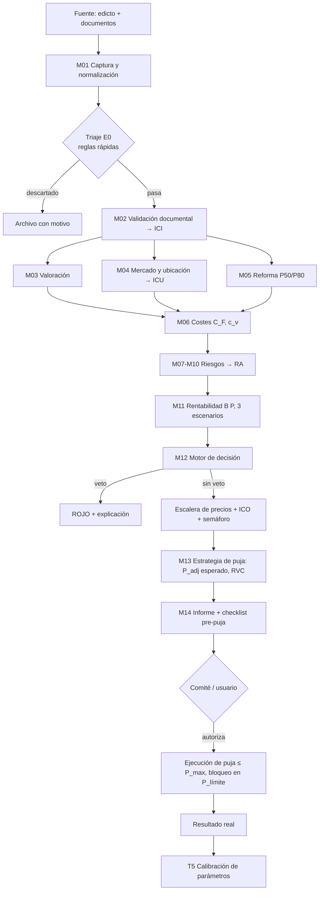

# SEIS — Sistema Experto de Inversión en Subastas

## Especificación Funcional y Técnica · Nivel Family Office

| Campo | Valor |
|---|---|
| Documento | Especificación funcional y técnica completa |
| Versión | 1.0 |
| Fecha | Julio 2026 |
| Estado | Base para desarrollo de plataforma comercial |
| Audiencia | Dirección de inversión, arquitectos de software, equipo de desarrollo |
| Principio rector | Decisión determinista, auditable y explicable. La IA estructura información; nunca decide. |

> **Nota de gobernanza:** los parámetros legales y fiscales citados (tipos impositivos, plazos procesales, responsabilidades del adjudicatario) se modelan como **datos versionados con fecha de vigencia**, no como código. Deben validarse con asesoría jurídico-fiscal antes de la puesta en producción y revisarse ante cada cambio normativo. El sistema es una herramienta de soporte a la decisión; la responsabilidad final de cada puja es del comité de inversión.

---

## Índice

1. Resumen ejecutivo
2. Filosofía y principios de diseño
3. Alcance: activos, tipos de subasta y estrategias
4. Arquitectura general del sistema
5. Modelo de datos y diseño de la base de datos
6. Módulos M01–M06: captura, validación, valoración, mercado, reforma y costes
7. Módulos M07–M11: motor de riesgos y rentabilidad
8. M12 — Motor de decisión experto
9. Algoritmo multicriterio de precios (ideal, objetivo, máximo, límite)
10. Perfiles de inversión y parametrización por estrategia
11. M13 — Estrategia de puja y viabilidad competitiva
12. M14 — Generación del informe
13. Checklist previo a la puja
14. Escalabilidad e integraciones (APIs y fuentes de datos, España)
15. Plan de implementación por fases
16. Stack tecnológico recomendado
17. Reparto: reglas deterministas vs. inteligencia artificial
18. Estrategia de minimización de costes computacionales
19. Ejemplo numérico completo de extremo a extremo
20. Gobernanza, calibración y evolución del sistema
21. Glosario y notación

---

# 1. Resumen ejecutivo

SEIS es una plataforma modular de análisis de inversión que recibe una oportunidad procedente de cualquier subasta (judicial, administrativa, tributaria, concursal, bancaria, notarial, de fondos o de plataformas privadas), sobre cualquier tipo de activo inmobiliario, y produce de forma completamente automática:

| Salida | Descripción |
|---|---|
| Decisión | Invertir / no invertir, con semáforo Verde · Amarillo · Naranja · Rojo |
| ICO (0–100) | Índice de Calidad de la Oportunidad |
| RA (0–100) | Riesgo Agregado, con desglose en 9 dimensiones |
| Escalera de precios | P_ideal < P_objetivo < P_max < P_límite (nunca superar) |
| Rentabilidad | ROI, ROI anualizado, TIR, cash-on-cash, por 3 escenarios |
| Margen de seguridad | Caída de mercado soportable y holgura de puja |
| RVC | Ratio de Viabilidad Competitiva (¿es alcanzable la operación a P_max?) |
| Informe | Documento completo con trazabilidad de cada regla disparada |
| Checklist | Lista de verificación previa a la puja con ítems bloqueantes |

**Decisiones de arquitectura clave**, desarrolladas a lo largo del documento:

1. **Motor híbrido de cuatro capas** (§8): vetos no compensatorios → matriz de riesgos → scoring multicriterio compensatorio (MCDA) → simulación de escenarios. Ni una suma de puntos ni un modelo opaco.
2. **Precio máximo por método residual estresado** (§9): se deriva del valor de salida prudente, los costes totales y el margen exigido en función del riesgo. No existe ningún porcentaje fijo sobre tasación en el sistema.
3. **La incertidumbre es una variable de primera clase** (§6.2, §8.6): si falta información, el Índice de Calidad de la Información (ICI) cae, el ICO baja, la prudencia sobre el valor de salida sube y el semáforo tiene techo.
4. **Reglas como datos** (§8.3): el conocimiento experto vive en ficheros YAML versionados con vigencia temporal, evaluados por un motor determinista con trazabilidad completa. Actualizar un criterio no requiere desplegar código.
5. **IA solo en la frontera no estructurada → estructurada** (§17): modelos pequeños extraen datos de edictos y notas simples y redactan la narrativa del informe. Todo cálculo, puntuación y decisión es determinista y reproducible.
6. **Embudo de tres etapas** (§18): triaje a coste cero → análisis completo por reglas → due diligence profunda solo para finalistas. Es lo que hace viable analizar miles de subastas al mes con un presupuesto computacional marginal.

---

# 2. Filosofía y principios de diseño

## 2.1 Por qué no un porcentaje fijo sobre tasación

La regla popular ("pujar hasta el 70 % del valor de tasación") falla por cuatro motivos estructurales:

1. **La tasación de subasta no es valor de mercado.** Puede estar desactualizada años, referirse a un estado del inmueble que ya no existe, o estar inflada/deflactada por el interés procesal de alguna parte. Anclar la decisión a ese número transmite su error a toda la operación.
2. **Ignora los costes específicos de cada activo.** Dos pisos con idéntica tasación pueden diferir en 60.000 € de desalojo, deudas de comunidad, reforma y cargas subsistentes. Un porcentaje fijo trata ambos igual.
3. **Ignora la estrategia.** El mismo activo vale distinto para un flipper (valor = venta post-reforma − costes − margen) que para un rentista (valor = rentas capitalizadas) o un promotor (valor residual del suelo).
4. **Ignora el riesgo y la incertidumbre.** Un activo con posesión verificada y nota simple limpia admite pagar más que uno con ocupante desconocido y documentación incompleta, aunque sus tasaciones coincidan.

**Sustitución:** el precio máximo se deriva hacia atrás desde el valor de salida (`P_max = f(VS, costes, margen exigido por riesgo, escenarios)`), método residual que emplean fondos y family offices, con estrés de escenarios y primas de riesgo explícitas. La tasación de subasta queda como una variable informativa más (define tramos de puja y ratios históricos de adjudicación), nunca como ancla de valor.

## 2.2 Principios de diseño (nivel institucional)

| # | Principio | Implicación técnica |
|---|---|---|
| P1 | Determinismo y reproducibilidad | Mismo input + misma versión de reglas ⇒ mismo output, byte a byte. Los análisis se guardan como snapshots inmutables. |
| P2 | Explicabilidad total | Cada número del informe es trazable a reglas, parámetros y evidencias concretas. Nada de "caja negra". |
| P3 | Separación conocimiento / mecanismo | Las reglas, ponderaciones y parámetros legales son datos versionados; el motor solo los evalúa. |
| P4 | La ausencia de datos penaliza | Ningún dato ausente se rellena con el valor optimista. Falta de información ⇒ menor ICO, mayor prudencia, techo de semáforo. |
| P5 | Asimetría prudente | Los errores de sobrestimación de valor son más caros que los de infraestimación. Todas las estimaciones inciertas se toman en su banda conservadora (P50 para plan, P80 para estrés). |
| P6 | Vetos antes que promedios | Un defecto letal (carga no purgable, imposibilidad de inscripción) no se compensa con buena ubicación. Primero lexicográfico, después compensatorio. |
| P7 | El capital tiene coste y el tiempo es un coste | Toda rentabilidad se anualiza; toda inmovilización (consignaciones incluidas) se computa. |
| P8 | Módulos independientes con contratos tipados | Cada módulo es sustituible (regla → heurística → modelo) sin tocar al resto. |
| P9 | Humano en el bucle donde el error es caro | Las extracciones documentales críticas requieren validación humana hasta que la tasa de error medida lo permita. |
| P10 | Aprendizaje sin pérdida de control | El feedback de resultados reales recalibra parámetros (márgenes, ratios de adjudicación), nunca reescribe reglas de forma autónoma. |

## 2.3 Función objetivo del sistema

El sistema maximiza el valor esperado ajustado al riesgo del capital, sujeto a restricciones duras:

```
maximizar   E[Beneficio(P)] / CapitalInmovilizado(P), anualizado
sujeto a    P ≤ P_límite                    (bloqueo duro de software)
            Beneficio_pesimista(P) ≥ piso_pérdida(perfil)
            sin vetos activos
            RVC = P_max / P_adj_esperado ≥ umbral de viabilidad
            liquidez y plazo dentro del mandato del inversor
```

---

# 3. Alcance

## 3.1 Activos soportados

El modelo de datos es genérico (entidad `activo` + atributos extensibles en JSONB + plantillas por tipología), de modo que añadir una tipología nueva es añadir una plantilla de atributos, comparables y reglas, no modificar el esquema.

| Tipología | Particularidades que el sistema modela |
|---|---|
| Vivienda (piso/casa) | Ocupación, ITE/IEE, comunidad, VPO, retracto arrendaticio, vivienda habitual del ejecutado (porcentajes especiales de adjudicación) |
| Garaje / trastero | Vinculación registral a vivienda, estatutos que limiten venta separada, alta liquidez unitaria, análisis por lotes |
| Local comercial | IVA vs. ITP, licencia de actividad, fachada/escaparate, renta por zona comercial, cambio de uso a vivienda |
| Oficina | Obsolescencia, divisibilidad, certificación energética, mercado de alquiler corporativo |
| Nave industrial | Suelo/cubierta (amianto), potencia eléctrica, alturas libres, logística de proximidad |
| Suelo urbano | Edificabilidad, cargas de urbanización, método residual dinámico, plazos de licencia |
| Suelo rústico | Régimen de protección, usos permitidos, PAC, riesgo de expectativa urbanística (veto si estrategia = desarrollo sin cobertura legal) |
| Hotel / activo singular | Valoración por EBITDA/habitación, licencias turísticas, unidad productiva en concurso |
| Otros (gasolineras, residencias, edificios completos…) | Vía plantilla de tipología + reglas específicas |

## 3.2 Tipos de subasta soportados

Cada fuente se modela con un **perfil de fuente** que parametriza: normativa aplicable, calendario y cierre, depósito exigido, plazos de pago, tratamiento de cargas, posibilidad de cesión de remate, IVA/ITP típico, ratio histórico de adjudicación y riesgos característicos. Añadir una fuente = añadir un perfil + un adaptador de ingesta (§14).

| Fuente | Rasgos que cambian el análisis (ejemplos parametrizados) |
|---|---|
| Judicial (Portal de Subastas BOE, LEC) | Depósito 5 % del valor de subasta; pago del remate en plazo legal tras adjudicación; cargas anteriores subsisten; posibles porcentajes mínimos de adjudicación según sea o no vivienda habitual; cesión de remate solo por el ejecutante; posibilidad de sobreseimiento |
| Administrativa / Hacienda (AEAT) | Mesas de subasta, tramos, adjudicación directa en fases posteriores, cargas y afecciones fiscales |
| Seguridad Social (TGSS) | Procedimiento propio, lotes frecuentes, información documental típicamente más pobre (↓ICI) |
| Concursal | Venta de unidad productiva vs. activo aislado, autorización del juez, purga de cargas según plan de liquidación, plazos largos |
| Bancaria / servicers | Sin depósito judicial, negociación posible, dación de información amplia, precios de cartera |
| Notarial | Venta extrajudicial hipotecaria, plazos y depósitos propios |
| Fondos / plataformas privadas | Reglas contractuales ad hoc, fees de plataforma, procesos competitivos con rondas |

## 3.3 Estrategias de inversión soportadas

Reforma ligera, reforma integral, flip, compra para alquilar (buy&hold), cambio de uso, división horizontal, promoción y compra oportunista. Su efecto sobre cada módulo se especifica en §10; la elección de estrategia puede ser manual o sugerida por el propio motor (árbol de §8.7.4).

---

# 4. Arquitectura general del sistema

## 4.1 Patrón arquitectónico

**Pipeline orquestado (DAG) + pizarra de hechos (blackboard) + motor de reglas versionado**, sobre una arquitectura hexagonal (puertos y adaptadores).

- **Pipeline DAG:** los 14 módulos se ejecutan como un grafo dirigido acíclico con dependencias explícitas. Permite paralelizar (valoración, mercado y reforma corren en paralelo), reintentar módulos aislados y sustituir la implementación de cualquiera (regla → heurística → modelo pequeño) sin tocar el resto (principio P8).
- **Pizarra de hechos (Fact Store):** todos los módulos leen y escriben *hechos tipados* en un espacio común por análisis (`analisis_id`). Es la simplificación práctica del patrón blackboard clásico de los sistemas expertos: fuentes de conocimiento independientes que cooperan sobre un estado compartido, con la diferencia de que aquí el orden lo fija el DAG (determinismo, P1) en lugar de un planificador oportunista.
- **Motor de reglas:** evalúa reglas declarativas (YAML versionado) contra la pizarra de hechos mediante encadenamiento hacia delante por prioridades (§8.3). Cada disparo queda registrado con sus evidencias (P2).
- **Hexagonal:** el dominio (cálculo y decisión) no conoce las fuentes. BOE, Catastro, portales o entrada manual son adaptadores intercambiables sobre los mismos puertos de entrada (§14).

**Por qué esta combinación y no otras:**

| Alternativa | Motivo de descarte como núcleo |
|---|---|
| ML end-to-end (un modelo que decide) | Opaco, no auditable, exige miles de operaciones etiquetadas con resultado real que no existen al inicio, y deriva con el mercado. Se reserva para calibración de parámetros en Fase 3 (P10). |
| LLM que razona la decisión | No determinista, coste por análisis, alucinaciones en cálculo financiero. Prohibido por diseño en la ruta de decisión (P1, §17). |
| Motor de reglas puro (sin scoring) | Las reglas capturan vetos y condiciones, pero no gradúan bien la calidad entre oportunidades aceptables. Se necesita la capa MCDA. |
| Scoring puro (suma ponderada) | Compensa defectos letales con virtudes irrelevantes. Se necesita la capa de vetos previa (P6). |
| Blackboard clásico con planificador | Orden no determinista de activación ⇒ rompe P1. Se conserva la pizarra, se elimina el oportunismo. |

El motor de decisión resultante (vetos → riesgos → MCDA → escenarios) se especifica en §8.

## 4.2 Vista de capas

```
┌────────────────────────────────────────────────────────────────────────────┐
│ CAPA 5 · PRESENTACIÓN      Web (Next.js) · Informe PDF/HTML · Alertas      │
├────────────────────────────────────────────────────────────────────────────┤
│ CAPA 4 · DECISIÓN          M12 Motor de decisión · M13 Estrategia de puja  │
│                            M14 Generación de informe                       │
├────────────────────────────────────────────────────────────────────────────┤
│ CAPA 3 · ANÁLISIS          M03 Valoración · M04 Mercado/Ubicación          │
│                            M05 Reforma · M06 Costes · M07–M10 Riesgos      │
│                            M11 Rentabilidad y escenarios                   │
├────────────────────────────────────────────────────────────────────────────┤
│ CAPA 2 · CONOCIMIENTO      T2 Motor de reglas (YAML versionado)            │
│   (transversal)            T3 Parámetros legales/fiscales con vigencia     │
│                            T5 Calibración por feedback de resultados       │
├────────────────────────────────────────────────────────────────────────────┤
│ CAPA 1 · DATOS             M01 Captura/normalización · M02 Validación doc. │
│                            T1 Pizarra de hechos · PostgreSQL+PostGIS       │
│                            T4 Auditoría y snapshots inmutables             │
├────────────────────────────────────────────────────────────────────────────┤
│ CAPA 0 · ADAPTADORES       Manual · BOE/AEAT/TGSS · Catastro · Registro    │
│                            Portales · INE · OSM · OCR+LLM extracción       │
└────────────────────────────────────────────────────────────────────────────┘
```

## 4.3 Mapa conceptual del sistema

```
                                 ┌───────────────────────┐
                                 │  OPORTUNIDAD DE       │
                                 │  SUBASTA (fuente)     │
                                 └──────────┬────────────┘
                                            │ edicto, avalúo, nota simple, fotos
                    ┌───────────────────────┼────────────────────────┐
                    ▼                       ▼                        ▼
             ┌────────────┐         ┌──────────────┐         ┌──────────────┐
             │ M01 CAPTURA│         │ M02 VALIDAC. │         │ PERFIL DE    │
             │ normaliza  │────────▶│ DOCUMENTAL   │         │ INVERSIÓN    │
             └─────┬──────┘         │  → ICI 0-100 │         │ (estrategia) │
                   │                └──────┬───────┘         └──────┬───────┘
                   ▼                       │                        │
     ┌─────────────────────────── PIZARRA DE HECHOS ────────────────┼──────────┐
     │                                                              ▼          │
     │   ┌──────────┐  ┌───────────┐  ┌──────────┐  ┌──────────────────────┐   │
     │   │M03 VALOR │  │M04 MERCADO│  │M05 REFOR.│  │M06 COSTES            │   │
     │   │ VM, VS   │  │ ICU, liq. │  │ P50/P80  │  │ C_F, c_v, por fases  │   │
     │   └────┬─────┘  └─────┬─────┘  └────┬─────┘  └──────────┬───────────┘   │
     │        └────────┬─────┴─────────────┴───────────────────┘               │
     │                 ▼                                                       │
     │   ┌──────────────────────────────┐    ┌──────────────────────────────┐  │
     │   │ M07-M10 RIESGOS (9 dimens.)  │───▶│ M11 RENTABILIDAD             │  │
     │   │ matriz P×I → RA 0-100        │    │ B(P), ROI, TIR · 3 escenarios│  │
     │   └──────────────────────────────┘    └──────────────┬───────────────┘  │
     └──────────────────────────────────────────────────────┼──────────────────┘
                                                            ▼
                                    ┌───────────────────────────────────────┐
                                    │ M12 MOTOR DE DECISIÓN                 │
                                    │ vetos → ICO → escalera de precios →   │
                                    │ semáforo (V/A/N/R) + explicación      │
                                    └───────────────┬───────────────────────┘
                                                    ▼
                        ┌───────────────────────────┴─────────────────────────┐
                        ▼                                                     ▼
            ┌───────────────────────┐                         ┌───────────────────────┐
            │ M13 ESTRATEGIA PUJA   │                         │ M14 INFORME +         │
            │ P_adj esperado, RVC,  │                         │ CHECKLIST PRE-PUJA    │
            │ plan de tramos        │                         │ trazabilidad completa │
            └───────────┬───────────┘                         └───────────────────────┘
                        ▼
            ┌───────────────────────┐        resultado real (adjudicación, venta)
            │ EJECUCIÓN DE LA PUJA  │───────────────────────────────┐
            └───────────────────────┘                               ▼
                                                       ┌─────────────────────────┐
                                                       │ T5 FEEDBACK/CALIBRACIÓN │
                                                       │ recalibra parámetros    │
                                                       └─────────────────────────┘
```

## 4.4 Catálogo de módulos

| ID | Módulo | Función en una línea | Implementación F1 |
|---|---|---|---|
| M01 | Captura y normalización | Convierte cualquier fuente en un `ActivoNormalizado` + `HechosSubasta` | Formulario + adaptadores |
| M02 | Validación documental | Verifica documentos, coherencia y calcula ICI (0–100) | Reglas + checklist |
| M03 | Valoración inmobiliaria | VM actual y VS de salida con banda de confianza, por comparables | Algoritmo determinista |
| M04 | Estudio de mercado y ubicación | ICU (0–100), tendencia, liquidez, tiempos de venta/alquiler | Reglas + datos externos |
| M05 | Estimación de reforma | Presupuesto P50/P80 por partidas y nivel; riesgo técnico | Baremos €/m² paramétricos |
| M06 | Cálculo de costes | Consolida todos los costes: fijos (C_F) y proporcionales a P (c_v) | Fórmulas + parámetros legales |
| M07 | Riesgo jurídico | Cargas, ocupación, documental, procesal → score P×I | Reglas + árboles |
| M08 | Riesgo urbanístico | Planeamiento, licencias, disciplina, afecciones → score P×I | Reglas |
| M09 | Riesgo financiero | Financiación, liquidez de caja, tipos, DSCR → score P×I | Fórmulas |
| M10 | Riesgo comercial y mercado | Demanda, liquidez del activo, ciclo → score P×I | Reglas + datos M04 |
| M11 | Rentabilidad y escenarios | B(P), I(P), ROI, TIR, cash-on-cash en 3 escenarios | Fórmulas cerradas |
| M12 | Motor de decisión | Vetos, ICO, escalera de precios, semáforo, explicación | Motor de reglas + MCDA |
| M13 | Estrategia de puja | P_adj_esperado, RVC, plan de tramos, límites duros | Heurísticas + histórico |
| M14 | Generación de informe | Informe completo + checklist, con trazabilidad | Plantillas (+LLM narrativa) |
| T1–T5 | Transversales | Pizarra de hechos, motor de reglas, parámetros legales, auditoría, calibración | Servicios comunes |

## 4.5 Contratos de datos entre módulos

Los módulos se comunican exclusivamente mediante esquemas tipados (Pydantic), validados en cada frontera. Extracto de los contratos principales (los campos completos, en el diccionario de variables §5.3):

```python
class ActivoNormalizado(BaseModel):
    activo_id: UUID
    tipologia: Tipologia                  # vivienda, garaje, local, suelo_urbano, ...
    ref_catastral: str | None
    finca_registral: str | None
    direccion: Direccion                  # normalizada + geocodificada (lat, lon)
    superficie_m2: Decimal | None
    atributos: dict                       # JSONB validado contra plantilla de tipología
    fuentes: list[EvidenciaDato]          # procedencia de cada dato (P2)

class HechosSubasta(BaseModel):
    subasta_id: UUID
    fuente: PerfilFuente                  # judicial_boe, aeat, tgss, concursal, ...
    valor_subasta: Decimal                # VT: valor a efectos de subasta
    puja_minima: Decimal | None
    deposito_pct: Decimal                 # p.ej. 0.05 en judicial
    fecha_cierre: datetime
    tramos: Decimal | None
    cargas: list[Carga]                   # rango, importe, ¿anterior? ¿se purga?
    ocupacion: EstadoOcupacion            # desconocida | vacio | precario | arrendado | ...
    es_vivienda_habitual_ejecutado: bool | None

class Valoracion(BaseModel):              # salida M03
    vm_actual: Decimal; vm_rango: tuple[Decimal, Decimal]
    vs_salida: Decimal; vs_rango: tuple[Decimal, Decimal]
    metodo: Literal["comparables","capitalizacion","residual","mixto"]
    n_comparables: int; dispersion_cv: Decimal; confianza: Decimal   # 0-1

class RiesgoEvaluado(BaseModel):           # salida M07-M10 (una por dimensión)
    dimension: DimensionRiesgo             # juridico, urbanistico, ..., 9 valores
    probabilidad: int                      # 1-5
    impacto: int                           # 1-5
    score: int                             # P×I, 1-25
    nivel: Literal["bajo","medio","alto","critico"]
    mitigable: bool
    condiciones_mitigacion: list[str]
    evidencias: list[EvidenciaDato]

class DecisionFinal(BaseModel):            # salida M12
    semaforo: Literal["verde","amarillo","naranja","rojo"]
    ico: int                               # 0-100
    ra: int                                # 0-100 riesgo agregado
    ici: int                               # 0-100 calidad de información
    precios: EscaleraPrecios               # ideal, objetivo, max, limite
    margen_seguridad_valor: Decimal        # % caída de VS soportable a P_objetivo
    rvc: Decimal                           # P_max / P_adj_esperado
    vetos: list[VetoDisparado]
    condiciones: list[str]                 # si naranja: condiciones para invertir
    explicacion: list[ReglaDisparada]      # trazabilidad completa
    version_reglas: str; version_parametros: str
```

## 4.6 Flujo completo de extremo a extremo



Secuencia temporal típica (análisis estándar, Fase 2): M01 2–10 min si hay extracción documental; M02–M11 < 5 s de cómputo; M12–M14 < 2 s. El cuello de botella es siempre la obtención de información, nunca el cálculo — de ahí que el ICI gobierne el análisis.

## 4.7 Principios transversales de ejecución

1. **Snapshot inmutable:** cada análisis congela inputs, versión de reglas, versión de parámetros y outputs (`analisis` en §5.2). Reanalizar crea un snapshot nuevo; nunca se sobrescribe (auditoría estilo institucional).
2. **Idempotencia:** relanzar un módulo con los mismos hechos produce el mismo resultado.
3. **Grados de confianza propagados:** cada hecho lleva `confianza` y `fuente`; los módulos degradan sus salidas cuando sus insumos son débiles.
4. **Re-análisis por eventos:** cambio de fecha de subasta, nueva nota simple o cambio de parámetros legales dispara re-ejecución del subgrafo afectado del DAG.

---

# 5. Modelo de datos y diseño de la base de datos

Motor: **PostgreSQL 16 + PostGIS** (geoespacial) + JSONB (atributos por tipología). Una única base relacional cubre las fases 0–3; no se necesita nada más exótico hasta escalas muy superiores.

## 5.1 Modelo entidad–relación (vista lógica)

```
 fuente_subasta 1──N subasta 1──N lote 1──N activo N──1 zona (micro) N──1 zona (macro)
                          │                   │
                          │                   ├──N carga
                          │                   ├──1 ocupacion
                          │                   ├──N documento 1──N extraccion
                          │                   ├──N comparable_uso (N──1 comparable)
                          │                   └──N coste_partida (por análisis)
                          │
                          └──N analisis (snapshot) ──N riesgo_evaluado
                                   │                ──N escenario
                                   │                ──1 decision
                                   │                ──N regla_disparada
                                   │                ──1 informe
                                   └──N puja / seguimiento ──1 resultado_real
 regla (versionada) · parametro (versionado) · perfil_inversion · usuario · auditoria
```

## 5.2 Esquema de tablas (DDL condensado)

```sql
-- === FUENTES Y SUBASTAS =====================================================
CREATE TABLE fuente_subasta (
  id smallserial PRIMARY KEY,
  codigo text UNIQUE NOT NULL,            -- 'judicial_boe','aeat','tgss','concursal','banco','notarial','privada'
  perfil jsonb NOT NULL                   -- deposito_pct, plazo_pago_dias, purga_cargas, cesion_remate, tramos...
);

CREATE TABLE subasta (
  id uuid PRIMARY KEY, fuente_id smallint REFERENCES fuente_subasta,
  identificador_externo text, url text,
  valor_subasta numeric(14,2), puja_minima numeric(14,2), tramo numeric(12,2),
  deposito_pct numeric(5,4), fecha_inicio timestamptz, fecha_cierre timestamptz,
  estado text CHECK (estado IN ('anunciada','abierta','cerrada','suspendida','cancelada')),
  datos_brutos jsonb, creado_en timestamptz DEFAULT now()
);

-- === ACTIVO Y ENTORNO =======================================================
CREATE TABLE activo (
  id uuid PRIMARY KEY, subasta_id uuid REFERENCES subasta, lote smallint DEFAULT 1,
  tipologia text NOT NULL,                -- vivienda, garaje, trastero, local, oficina, nave, suelo_urbano, suelo_rustico, hotel, singular
  ref_catastral text, finca_registral text, registro text, idufir text,
  direccion text, municipio text, provincia text, cp text,
  geom geometry(Point,4326), zona_micro_id int REFERENCES zona,
  superficie_m2 numeric(10,2), superficie_fuente text,   -- 'registro'|'catastro'|'medicion'
  anio_construccion smallint, estado_conservacion text,  -- 'ruina'|'malo'|'regular'|'bueno'|'reformado'
  atributos jsonb NOT NULL DEFAULT '{}',  -- validado contra plantilla_tipologia
  es_vivienda_habitual boolean, vpo boolean, notas text
);

CREATE TABLE zona (                        -- jerárquica: macro (municipio/distrito) y micro (barrio/sección censal)
  id serial PRIMARY KEY, padre_id int REFERENCES zona, nivel text CHECK (nivel IN ('macro','micro')),
  nombre text, geom geometry(MultiPolygon,4326),
  indicadores jsonb,                       -- {precio_m2_venta, precio_m2_alquiler, tendencia_5a, dom_dias, stock, renta_hogar,
                                           --  crecimiento_pobl, criminalidad_idx, ...} con fecha por indicador
  icu smallint, icu_desglose jsonb, icu_calculado_en timestamptz
);

CREATE TABLE carga (
  id uuid PRIMARY KEY, activo_id uuid REFERENCES activo,
  tipo text,                               -- hipoteca, embargo, afeccion_fiscal, servidumbre, condicion_resolutoria, censo...
  rango int, importe numeric(14,2), acreedor text,
  es_anterior boolean, se_purga boolean, fuente text, verificada boolean DEFAULT false
);

CREATE TABLE ocupacion (
  activo_id uuid PRIMARY KEY REFERENCES activo,
  estado text CHECK (estado IN ('desconocida','vacio','propietario','precario','arrendado_posterior',
                                'arrendado_anterior','renta_antigua','indeterminada')),
  titulo_verificado boolean, fecha_contrato date, renta_mensual numeric(10,2),
  evidencia text, coste_estimado numeric(12,2), meses_estimados smallint
);

-- === DOCUMENTOS Y EXTRACCIÓN ================================================
CREATE TABLE documento (
  id uuid PRIMARY KEY, activo_id uuid REFERENCES activo,
  tipo text,                               -- edicto, nota_simple, avaluo, cert_cargas, ite, cee, estatutos, foto, plano...
  fichero text, hash_sha256 text UNIQUE, fecha_documento date, subido_en timestamptz
);
CREATE TABLE extraccion (
  id uuid PRIMARY KEY, documento_id uuid REFERENCES documento,
  motor text,                              -- 'manual' | 'llm:<modelo>@<version>' | 'ocr'
  esquema_version text, datos jsonb, confianza numeric(4,3),
  validado_por uuid REFERENCES usuario, validado_en timestamptz    -- P9: humano en el bucle
);

-- === VALORACIÓN =============================================================
CREATE TABLE comparable (
  id uuid PRIMARY KEY, tipologia text, geom geometry(Point,4326), zona_micro_id int,
  superficie_m2 numeric(10,2), precio numeric(14,2), precio_m2 numeric(10,2),
  estado text, fecha_dato date, origen text,   -- portal, notarial, registro, testigo_propio
  atributos jsonb, activo boolean DEFAULT true
);
CREATE TABLE valoracion (
  id uuid PRIMARY KEY, analisis_id uuid, metodo text,
  vm numeric(14,2), vm_min numeric(14,2), vm_max numeric(14,2),
  vs numeric(14,2), vs_min numeric(14,2), vs_max numeric(14,2),
  n_comparables int, dispersion_cv numeric(5,4), confianza numeric(4,3), detalle jsonb
);

-- === ANÁLISIS (SNAPSHOT INMUTABLE) ==========================================
CREATE TABLE analisis (
  id uuid PRIMARY KEY, activo_id uuid REFERENCES activo,
  perfil_inversion_id int REFERENCES perfil_inversion,
  version_reglas text NOT NULL, version_parametros text NOT NULL,
  hechos jsonb NOT NULL,                   -- pizarra completa serializada (P1, P2)
  ici smallint, icu smallint, ra smallint, ico smallint,
  creado_en timestamptz DEFAULT now(), creado_por uuid
);
CREATE TABLE riesgo_evaluado (
  analisis_id uuid REFERENCES analisis, dimension text,
  probabilidad smallint, impacto smallint, score smallint, nivel text,
  mitigable boolean, condiciones jsonb, evidencias jsonb,
  PRIMARY KEY (analisis_id, dimension)
);
CREATE TABLE escenario (
  analisis_id uuid REFERENCES analisis, nombre text,      -- pesimista | base | optimista
  probabilidad numeric(4,3), vs numeric(14,2), plazo_meses smallint,
  coste_total numeric(14,2), beneficio numeric(14,2), roi numeric(6,4), tir numeric(6,4),
  PRIMARY KEY (analisis_id, nombre)
);
CREATE TABLE decision (
  analisis_id uuid PRIMARY KEY REFERENCES analisis,
  semaforo text, p_ideal numeric(14,2), p_objetivo numeric(14,2),
  p_max numeric(14,2), p_limite numeric(14,2),
  margen_seguridad numeric(5,4), p_adj_esperado numeric(14,2), rvc numeric(5,3),
  vetos jsonb, condiciones jsonb
);
CREATE TABLE regla_disparada (
  id bigserial PRIMARY KEY, analisis_id uuid REFERENCES analisis,
  regla_codigo text, regla_version text, efecto jsonb, evidencias jsonb, orden int
);

-- === CONOCIMIENTO VERSIONADO (T2, T3) =======================================
CREATE TABLE regla (
  codigo text, version text, categoria text,        -- veto | riesgo | ajuste | semaforo | triaje | puja
  definicion jsonb NOT NULL,                        -- condición + efecto en formato declarativo (§8.3)
  vigente_desde date, vigente_hasta date, autor text, justificacion text,
  PRIMARY KEY (codigo, version)
);
CREATE TABLE parametro (
  clave text, ambito text,                          -- 'nacional' | CCAA | municipio | fuente_subasta | tipologia
  valor jsonb, vigente_desde date, vigente_hasta date, fuente_legal text,
  PRIMARY KEY (clave, ambito, vigente_desde)        -- p.ej. ('itp_tipo_general','andalucia', 0.07, ...)
);
CREATE TABLE perfil_inversion (
  id serial PRIMARY KEY, codigo text UNIQUE,        -- flip_ligero, flip_integral, rentista, cambio_uso, division, promocion, oportunista
  parametros jsonb NOT NULL                         -- m_objetivo, m_min, y_req, horizonte, pesos_ico, pisos_pesimista... (§10)
);

-- === EJECUCIÓN Y APRENDIZAJE (T5) ===========================================
CREATE TABLE puja (
  id uuid PRIMARY KEY, analisis_id uuid, fecha timestamptz, importe numeric(14,2),
  resultado text            -- ganada | superada | retirada | suspendida
);
CREATE TABLE resultado_real (
  analisis_id uuid PRIMARY KEY,
  precio_adjudicacion numeric(14,2), adjudicatario_propio boolean,
  coste_real_total numeric(14,2), precio_venta_real numeric(14,2), renta_real numeric(10,2),
  plazo_real_meses smallint, incidencias jsonb, cerrado_en date
);
CREATE TABLE auditoria (
  id bigserial PRIMARY KEY, quien uuid, cuando timestamptz DEFAULT now(),
  entidad text, entidad_id text, accion text, delta jsonb
);
-- Índices clave: GIST en geom (activo, zona, comparable); GIN en atributos/indicadores;
-- btree (tipologia, zona_micro_id, fecha_dato) en comparable; (estado, fecha_cierre) en subasta.
```

## 5.3 Diccionario de variables principales

Convención: `[E]` entrada externa/manual · `[C]` calculada · `[P]` parámetro versionado. Se listan las ~70 variables núcleo; los atributos específicos por tipología viven en plantillas JSONB.

| Variable | Tipo | Origen | Descripción |
|---|---|---|---|
| `VT` | € [E] | Subasta | Valor de subasta / tasación a efectos de subasta |
| `puja_minima` | € [E] | Subasta | Puja mínima admisible según fuente |
| `deposito_pct` | % [P] | Fuente | Consignación exigida para pujar (p. ej. 5 % judicial) |
| `plazo_pago_dias` | d [P] | Fuente | Días para consignar el remate tras adjudicación |
| `fecha_cierre` | fecha [E] | Subasta | Cierre de la subasta (gobierna el tiempo de análisis) |
| `superficie_m2` | m² [E] | Activo | Superficie; discrepancia registro/catastro genera hecho de riesgo |
| `estado_conservacion` | enum [E] | Activo | ruina/malo/regular/bueno/reformado → nivel de reforma |
| `cargas[]` | lista [E] | Registro | Cargas con rango, importe, anterioridad y purga |
| `carga_subsistente_total` | € [C] | M07 | Σ cargas anteriores que asumirá el adjudicatario |
| `ocupacion.estado` | enum [E] | Investigación | Ver tabla ocupación §7.2 |
| `VM` | € [C] | M03 | Valor de mercado actual, estado actual |
| `VS` | € [C] | M03 | Valor de salida tras ejecutar la estrategia (venta o capitalización) |
| `VS_p` | € [C] | M12 | VS prudente = VS·(1−δ_v) |
| `δ_v` | % [C] | M12 | Descuento de prudencia sobre VS = f(riesgo mercado, ICI, dispersión comparables) |
| `n_comp, CV_comp` | n,% [C] | M03 | Nº de comparables y coeficiente de variación (dispersión) |
| `ICU` | 0–100 [C] | M04 | Índice de Calidad de Ubicación (§6.4) |
| `tendencia_5a` | %/a [E] | M04 | Variación anual media del precio de zona (5 años) |
| `DOM_venta, DOM_alq` | días [E] | M04 | Tiempo medio de venta / alquiler en zona |
| `RNA` | €/a [C] | M04+M11 | Renta neta anual estabilizada (estrategia rentista) |
| `y_req` | % [C] | M12 | Rentabilidad neta exigida = y_zona + primas de riesgo (§9.4) |
| `Ref_P50, Ref_P80` | € [C] | M05 | Presupuesto de reforma mediano y estresado |
| `C_F` | € [C] | M06 | Costes fijos totales independientes del precio de adjudicación |
| `c_v` | % [C] | M06 | Costes proporcionales al precio (ITP/AJD + aranceles variables + financiación s/P) |
| `conting_pct` | % [C] | M06 | Contingencia = f(RA, ICI) sobre reforma+posesión (§9.4) |
| `plazo_meses` | m [C] | M11 | Horizonte total estimado (posesión + obra + venta/alquiler) |
| `I(P)` | € [C] | M11 | Inversión total = P·(1+c_v) + C_F |
| `B(P)` | € [C] | M11 | Beneficio = VS_p − I(P) (o flujo rentista) |
| `ROI, ROI_a, TIR, CoC` | % [C] | M11 | Rentabilidades: total, anualizada, interna, cash-on-cash |
| `DSCR` | ratio [C] | M09 | Cobertura del servicio de deuda (rentista apalancado) |
| `R_i (i=1..9)` | 1–25 [C] | M07–M10 | Score de cada dimensión de riesgo (probabilidad × impacto) |
| `RA` | 0–100 [C] | M12 | Riesgo agregado con regla de dominancia (§7.4) |
| `ICI` | 0–100 [C] | M02 | Índice de Calidad de la Información (§6.2) |
| `ICO` | 0–100 [C] | M12 | Índice de Calidad de la Oportunidad (§8.5) |
| `m*, m_min` | % [P/C] | Perfil+M12 | Margen objetivo y mínimo sobre inversión, ajustados por RA |
| `P_ideal, P_objetivo, P_max, P_limite` | € [C] | M12 | Escalera de precios (§9) |
| `MS_valor` | % [C] | M12 | Margen de seguridad: caída de VS soportable sin pérdida |
| `MS_puja` | % [C] | M13 | Holgura: (P_max − puja actual)/P_max |
| `P_adj_esperado` | € [C] | M13 | Precio de adjudicación esperado (histórico por segmento) |
| `RVC` | ratio [C] | M13 | P_max / P_adj_esperado — viabilidad competitiva |
| `semaforo` | enum [C] | M12 | verde / amarillo / naranja / rojo |
| `itp_tipo, iva_aplica, ajd_tipo` | % [P] | T3 | Fiscalidad por CCAA y naturaleza del transmitente |
| `arancel_notaria, arancel_registro` | f(P) [P] | T3 | Funciones escalonadas parametrizadas |
| `responsabilidad_comunidad` | regla [P] | T3 | Anualidad corriente + N anteriores (LPH, parametrizado) |
| `afeccion_ibi` | regla [P] | T3 | Ejercicios de IBI no prescritos que persigue el inmueble |
| `euribor, tipo_prestamo, ltv_max` | % [P/E] | T3/M09 | Condiciones de financiación vigentes |

---

# 6. Módulos M01–M06: datos, valoración, mercado, reforma y costes

Formato de especificación de cada módulo: **función · entradas · salidas · lógica interna · reglas vs. IA · interacciones**.

## 6.1 M01 — Captura y normalización de datos

**Función.** Convertir cualquier oportunidad (formulario manual, edicto del BOE, expediente AEAT/TGSS, dossier bancario, anuncio de plataforma) en las entidades canónicas `ActivoNormalizado` + `HechosSubasta`, con procedencia y confianza por dato.

**Entradas.** Documentos (PDF/HTML/imagen), formularios, respuestas de APIs (Fase 2+). **Salidas.** Entidades canónicas persistidas + hechos iniciales en la pizarra + cola de documentos para M02.

**Lógica interna.**
1. *Adaptador por fuente* (puerto hexagonal): cada fuente tiene su parser/mapa de campos.
2. *Extracción documental* (Fase 2): OCR si es imagen → LLM pequeño con salida JSON validada contra esquema Pydantic → si el JSON no valida, un reintento; si vuelve a fallar, cola de revisión humana (P9). Campos críticos (importes de cargas, estado posesorio, superficies) nacen con `verificado=false` hasta validación humana mientras la tasa de error medida del extractor supere el umbral (§17).
3. *Normalización*: direcciones geocodificadas, referencia catastral validada (dígito de control), superficies conciliadas registro/catastro (discrepancia > 10 % ⇒ hecho `superficie_inconsistente`).
4. *Deduplicación* por (ref. catastral | finca registral | hash de dirección): el mismo activo puede aparecer en varias subastas sucesivas — el historial de subastas desiertas es información valiosa para M13.
5. *Triaje E0* (§18): reglas baratas que descartan de inmediato lo que nunca será invertible para el mandato (fuera de zonas objetivo, tipología excluida, importe fuera de rango de capital, cierre en < 48 h con ICI previsiblemente < 25).

**Reglas vs. IA.** Parsing y validación: determinista. Extracción de texto libre: LLM pequeño (único punto de IA de entrada). **Interactúa con** M02 (le entrega documentos), T1 (escribe hechos), M13 (historial de subastas del mismo activo).

## 6.2 M02 — Validación documental → ICI

**Función.** Verificar qué documentación existe, su frescura y su coherencia interna, y sintetizarlo en el **Índice de Calidad de la Información (ICI, 0–100)**, que gobierna la prudencia de todo el análisis (principio P4).

**Entradas.** Documentos y datos de M01. **Salidas.** `ICI`, lista de carencias con su coste de subsanación (pedir nota simple ≈ 10–20 €, visita ≈ medio día…), hechos de inconsistencia, riesgo documental preliminar para M07.

**Cálculo del ICI.** Checklist ponderado por tipología y fuente; cada ítem puntúa `presencia × frescura × fiabilidad_origen`:

| Ítem (vivienda, subasta judicial) | Peso | Frescura plena |
|---|---|---|
| Nota simple registral | 18 | ≤ 15 días |
| Certificación de cargas / edicto completo con cargas | 14 | vigente para la subasta |
| Situación posesoria verificada (acta, informe, vecinos) | 14 | ≤ 60 días |
| Avalúo / informe de tasación de la subasta | 8 | — |
| Fotografías interiores o visita | 10 | ≤ 90 días |
| Fotografías exteriores / Street View reciente | 4 | ≤ 12 meses |
| Certificado deudas comunidad | 8 | ≤ 30 días |
| Recibo IBI / deuda IBI | 5 | último ejercicio |
| ITE/IEE (edificios obligados) y CEE | 5 | vigente |
| Referencia catastral conciliada con registro | 6 | — |
| Comparables suficientes (n ≥ 6, CV ≤ 20 %) | 8 | ≤ 6 meses |

`ICI = Σ pesoᵢ·presenciaᵢ·frescuraᵢ·fiabilidadᵢ`, menos penalizaciones por **inconsistencias detectadas** (−5 a −15 cada una: superficies que no cuadran, cargas del edicto ≠ nota simple, tasación > 2× mediana de comparables…).

**Efectos del ICI en cascada** (se aplican en M12, se definen aquí):

| ICI | δ_v adicional | Contingencia extra | Techo de semáforo |
|---|---|---|---|
| ≥ 80 | +0 pp | +0 pp | — |
| 60–79 | +2 pp | +2 pp | — |
| 40–59 | +5 pp | +4 pp | Amarillo |
| 25–39 | +9 pp | +7 pp | Naranja |
| < 25 | análisis "no concluyente" | — | Rojo (por ininvertible sin subsanar) |

**Reglas vs. IA.** 100 % determinista; la coherencia cruzada entre documentos puede apoyarse en la extracción LLM de M01, pero la puntuación es por reglas. **Interactúa con** todos los módulos (el ICI modula prudencia) y con M14 (lista de carencias → checklist).

## 6.3 M03 — Valoración inmobiliaria

**Función.** Estimar `VM` (valor de mercado en estado actual) y `VS` (valor de salida tras la estrategia), con rango de confianza, mediante un AVM ligero, determinista y explicable.

**Entradas.** Activo normalizado, comparables (tabla `comparable`), estrategia, salida de M05 (para VS por reforma). **Salidas.** `Valoracion` (§4.5): VM, VS, rangos, nº comparables, dispersión CV, confianza.

**Lógica interna (método principal: comparables ajustados).**
1. Selección: misma tipología, radio creciente 300 m → 800 m → zona micro → macro hasta n ≥ 6; antigüedad del dato ≤ 6 meses (≤ 12 con ajuste temporal por `tendencia_5a`).
2. Ajustes multiplicativos por diferencias observables (hedonic simplificado, coeficientes paramétricos por zona): superficie (elasticidad −0,1 sobre €/m² por tamaño relativo), planta/ascensor, exterior/interior, estado, terraza, año. Origen del dato: precios de **oferta** de portal se corrigen con descuento oferta→cierre paramétrico por zona (típico 4–9 %); testigos notariales/registrales, sin corrección.
3. Estimador robusto: **mediana ponderada** por similitud y frescura (no media: robustez a outliers). `VM = mediana_pond(€/m² ajustado) × m²`. Rango = percentiles 25–75 reescalados.
4. `VS` según estrategia: flip → comparables *en estado reformado*; rentista → `RNA / y_zona` contrastado con comparables; división → Σ VM de las unidades resultantes; suelo/promoción → **método residual dinámico** (ingresos por ventas − costes de construcción/urbanización − margen de promotor, descontados por plazo).
5. `confianza = f(n, CV, radio_usado, frescura)` → alimenta ICI (ítem comparables) y δ_v.
6. Contraste de sanidad: si `VT / VM ∉ [0,5 ; 1,6]` se emite hecho `tasacion_anomala` (ni se acepta ni se descarta: se investiga; suele ser la fuente de las mejores y de las peores operaciones).

**Reglas vs. IA.** Determinista. En Fase 3, *embeddings locales* para similitud de descripciones de comparables (§18) — mejora la selección, no cambia el estimador. **Interactúa con** M04 (tendencia, y_zona), M05 (VS reformado), M11/M12.

## 6.4 M04 — Estudio de mercado y ubicación → ICU

**Función.** Puntuar la ubicación (ICU 0–100), estimar liquidez (DOM venta/alquiler), tendencia y potencial de revalorización. **Filosofía: modelo compensatorio** — ningún indicador negativo aislado descarta; todos ponderan (requisito explícito del sistema).

**Entradas.** Geolocalización, tabla `zona` con indicadores (INE, portales, ministerios, ayuntamiento — §14; manual en Fase 0–1). **Salidas.** `ICU` con desglose, `tendencia_5a`, `DOM_venta`, `DOM_alq`, `y_zona`, `potencial_revalorizacion` (0–100), hechos para M10.

**Estructura del ICU = 40 % macro (municipio/distrito) + 60 % micro (barrio/sección censal):**

| Bloque | Indicador | Peso | Normalización 0–100 |
|---|---|---|---|
| Macro (40) | Tendencia de precios 5 años | 10 | percentil vs. distribución nacional; saturación en ±8 %/a |
| | Equilibrio oferta/demanda (stock, absorción) | 8 | meses de stock: ≤4 ⇒ 100 · ≥18 ⇒ 0 |
| | Tiempo medio de venta (DOM) | 7 | ≤60 d ⇒ 100 · ≥300 d ⇒ 0 |
| | Tiempo medio de alquiler | 5 | ≤15 d ⇒ 100 · ≥90 d ⇒ 0 |
| | Crecimiento poblacional 5 años | 5 | percentil nacional |
| | Renta media por hogar | 5 | percentil nacional |
| Micro (60) | Transporte público (paradas, frecuencia, metro/cercanías ≤ 600 m) | 10 | índice de accesibilidad |
| | Seguridad (inversa de criminalidad) | 8 | percentil invertido municipio/distrito |
| | Sanidad (hospital ≤ 3 km, centros de salud) | 5 | distancia decreciente |
| | Educación y universidades | 5 | presencia y proximidad |
| | Comercio y servicios de proximidad | 4 | densidad POI (OSM) |
| | Zonas verdes | 3 | superficie verde per cápita ≤ 800 m |
| | Desarrollo urbanístico e inversión pública prevista | 10 | pipeline verificable (proyectos aprobados > anunciados) |
| | Potencial de transformación / demanda emergente | 8 | reglas: ratio precio vs. zonas colindantes, señales de renovación |
| | Calidad del entorno construido inmediato | 7 | estado de calle/edificios (manual o visión en F3) |

**Ejemplo del requisito (barrio universitario):** transporte 90, universidad 100, sanidad 95, pipeline 80, comercio 85, verde 55, entorno 70, potencial 75; seguridad 45 (criminalidad algo superior); macro medio-alto (70). `ICU = 0,4·70 + 0,6·(media ponderada micro ≈ 77) ≈ 74`. El barrio **no se descarta**: sigue siendo bueno. La criminalidad moderada no veta: se traduce en (a) su peso dentro del ICU, (b) +0,3 pp en `y_req` si estrategia rentista (rotación/impago) y (c) +1 pp en δ_v si el producto de salida es familiar de reposición (la demanda universitaria/inversora, en cambio, no penaliza). Solo existen dos umbrales duros extremos: percentil de criminalidad > 98 con producto de lujo, y despoblación macro < percentil 3 con estrategia de desarrollo.

**Potencial de revalorización** (0–100) = f(pipeline verificado, diferencial de precio con colindantes de mayor calidad, tendencia relativa al municipio, saturación). Alimenta el ICO (§8.5) y el escenario optimista (M11), nunca el escenario base (P5: el upside no se paga por adelantado).

**Reglas vs. IA.** Determinista sobre datos externos; en Fase 0–1 los indicadores se cargan manualmente con una plantilla por zona (una vez por zona, reutilizable para todos los activos de la zona). **Interactúa con** M03 (y_zona, tendencia), M10 (liquidez → riesgo comercial), M12.

## 6.5 M05 — Estimación de reforma

**Función.** Presupuesto de obra P50 (plan) y P80 (estrés), por partidas, más plazo de obra y riesgo técnico preliminar.

**Entradas.** Tipología, superficie, año, estado de conservación, fotos/visita (si hay), atributos (baños, instalación eléctrica, ascensor del edificio…). **Salidas.** `Ref_P50`, `Ref_P80`, plazo_obra_meses, partidas[], hecho `riesgo_tecnico` para M07/M10, honorarios y licencias asociados para M06.

**Lógica interna (paramétrica por baremos):**
1. Clasificación del nivel de intervención por reglas sobre estado/año/fotos: `refresco (pintura y suelos) | ligera | media | integral | estructural`.
2. Coste base = `€/m² (nivel, tipología) × m² × k_provincia × k_calidad_acabados(estrategia)`. Los baremos €/m² son **parámetros versionados** (T3) actualizables con índices de costes de construcción; valores iniciales de referencia (vivienda, calidad media, 2026): refresco 90–150, ligera 300–450, media 500–700, integral 750–1.000, estructural 1.100+ €/m².
3. Partidas adicionales por reglas: cocina/baños unitarios, ascensor comunitario pendiente (derrama), amianto (naves/edificios antiguos), ICT, ITE desfavorable.
4. `P80 = P50 × (1 + spread(nivel, incertidumbre))`: spread 12 % en refresco con visita, hasta 35 % en integral sin visita (sin fotos ⇒ nivel asumido = el peor compatible con la evidencia, P5).
5. Suma técnica: honorarios (proyecto+dirección ≈ 6–9 % PEM si obra mayor), licencia/ICIO (parámetro municipal, típico 3–5 % PEM), tasas.

**Reglas vs. IA.** Determinista. Opcional F3: clasificación de estado desde fotos con modelo de visión pequeño, siempre con techo (nunca mejora el nivel por encima de lo verificado). **Interactúa con** M03 (VS reformado), M06 (coste), M07 (riesgo técnico), M11 (plazo).

## 6.6 M06 — Cálculo de costes (catálogo completo de costes ocultos)

**Función.** Consolidar **todos** los costes del ciclo completo en dos magnitudes que consume el algoritmo de precios: `C_F` (fijos, independientes del precio de adjudicación) y `c_v` (proporcionales a P), más el calendario de desembolsos para la TIR.

**Entradas.** Salidas de M02–M05, `HechosSubasta`, perfil de inversión, parámetros T3. **Salidas.** `C_F`, `c_v`, `conting_pct`, desglose por fase (adquisición → posesión → transformación → tenencia → salida), calendario de flujos.

**Catálogo (todo parametrizado en T3; nada cableado en código):**

| Fase | Partida | Modelo de cálculo |
|---|---|---|
| Adquisición | ITP (2ª transmisión) **o** IVA+AJD (según transmitente/renuncia exención) | árbol fiscal §8.7.3 → `tipo(CCAA) × P` → entra en `c_v` |
| | Notaría + Registro + gestoría | aranceles: función escalonada de P → aprox. lineal local en `c_v` + término fijo |
| | Procurador/abogado del proceso de puja | fijo |
| | Coste del depósito (5 %) y de depósitos de subastas perdidas | coste financiero del capital inmovilizado (P7) |
| Posesión | Desalojo/negociación según `ocupacion.estado` | tabla §7.2: coste legal + compensación ("cash for keys") + meses |
| | Deudas de comunidad heredadas | regla LPH parametrizada: anualidad corriente + N anteriores, del certificado o estimadas al alza |
| | IBI no prescrito (afección real) | ejercicios parametrizados × cuota |
| | Cerrajería, seguridad, seguro ocupación, tapiado si procede | fijos por reglas |
| Transformación | Reforma (M05) + licencias + honorarios + acometidas/boletines | P50 plan / P80 estrés |
| Tenencia | IBI, comunidad, seguros, suministros, tasa basuras × `plazo_meses` | mensual × plazo por escenario |
| | Financiación: apertura + interés `i × LTV × P × plazo` + tasación banco | entra parcialmente en `c_v` |
| Salida (venta) | Comercialización (agencia 3 % VS + marketing/home staging) | % sobre VS ⇒ dentro de C_F vía VS |
| | Plusvalía municipal (IIVTNU) del vendedor-analizado y CEE | parámetro municipal |
| | Fiscalidad sobre el beneficio (IS/IRPF según vehículo) | se reporta aparte: los umbrales de decisión son pre-impuestos sobre beneficio, configurable |
| Transversal | **Contingencia** | `conting_pct(RA, ICI)` × (reforma + posesión), §9.4 |

Salida formal: `I(P) = P·(1+c_v) + C_F` con `c_v = itp + arancel_var + fin_var` y `C_F = Σ fijos + Ref + posesión + tenencia + comercialización + contingencia`. Todos los sumandos con etiqueta P50/P80 para los dos niveles de estrés.

**Reglas vs. IA.** 100 % determinista. **Interactúa con** M11 (I(P), calendario), M12 (c_v, C_F en fórmulas de precio), M09 (estructura financiera).

---

# 7. Módulos M07–M11: motor de riesgos y rentabilidad

## 7.1 Marco común: taxonomía de 9 dimensiones y matriz P×I

Todas las dimensiones de riesgo se evalúan con el mismo formalismo para que sean comparables y agregables:

**Score de dimensión = Probabilidad (1–5) × Impacto (1–5) → 1–25**, donde ambos ejes se asignan por **reglas con evidencias**, nunca a ojo:

| Eje | 1 | 2 | 3 | 4 | 5 |
|---|---|---|---|---|---|
| Probabilidad | remota <5 % | baja 5–15 % | posible 15–35 % | probable 35–65 % | casi cierta >65 % |
| Impacto (sobre beneficio base) | <3 % | 3–8 % | 8–15 % | 15–30 % | >30 % o inviabiliza |

| Score P×I | Nivel |
|---|---|
| 1–4 | Bajo |
| 5–9 | Medio |
| 10–15 | Alto |
| 16–25 | Crítico |

**Reparto de las 9 dimensiones entre los 4 módulos propietarios:**

| # | Dimensión | Propietario | Evidencias que alimentan P e I |
|---|---|---|---|
| 1 | Jurídico | M07 | cargas, rango, purga, procedimiento, titularidad, VPO, retractos |
| 2 | Documental | M07 (calculado en M02) | ICI, inconsistencias, documentos caducados |
| 3 | Ocupación | M07 | estado posesorio, tipo de título, antigüedad contrato |
| 4 | Urbanístico | M08 | planeamiento, licencias, fuera de ordenación, afecciones |
| 5 | Técnico | M08 (evidencia de M05) | año, estado, ITE, patologías, amianto, sin visita |
| 6 | Financiero | M09 | estructura de capital, DSCR, sensibilidad a tipos, plazos de pago de la fuente |
| 7 | Comercial | M10 | adecuación producto-demanda, competencia, absorción |
| 8 | Liquidez | M10 (datos de M04) | DOM venta/alquiler, profundidad de mercado, singularidad |
| 9 | Mercado | M10 (datos de M04) | ciclo, tendencia, dependencia macro, concentración de demanda |

(El **riesgo de ejecución** de la propia subasta — suspensión, sobreseimiento, pérdida de depósito, plazos de consignación — se gestiona en M13 §11.4, porque afecta al proceso de puja, no a la calidad del activo.)

Cada `RiesgoEvaluado` sale con: score, nivel, `mitigable` (sí/no), `condiciones_mitigacion[]` (acciones que bajarían P o I: "obtener certificado de comunidad", "visita con cerrajero tras adjudicación", "contratar seguro de impago") y `evidencias[]`. Las condiciones alimentan el semáforo Naranja y el checklist.

## 7.2 M07 — Riesgo jurídico (dimensiones 1–3)

**Función.** Evaluar todo lo que puede impedir adquirir limpio, inscribir, poseer o disponer. **Entradas:** cargas, edicto, nota simple, ocupación, perfil de fuente, ICI. **Salidas:** 3 `RiesgoEvaluado` + `carga_subsistente_total` + hechos de veto candidatos.

**Reglas nucleares (extracto):**
- *Cargas:* las **anteriores** a la que se ejecuta subsisten (parámetro por fuente; en judicial es la regla general). `carga_subsistente_total = Σ importes verificados`; si no verificados, estimación al alza + penalización ICI. Dispara veto VETO-CARGA-01 si supera el 35 % de `VS_p` (§8.4).
- *Purga:* las posteriores se cancelan con el testimonio del decreto — coste de cancelación incluido en M06.
- *Inscripción:* doble inmatriculación, exceso de cabida relevante, tracto interrumpido ⇒ P alto, I alto (candidato a veto).
- *VPO:* si precio máximo legal de venta < coste total previsto ⇒ veto (salvo estrategia rentista compatible con renta limitada).
- *Retracto arrendaticio / tanteo administrativo:* baja I (retrasa, no destruye valor) salvo estrategia de reventa inmediata.
- *Situación procesal:* recursos pendientes contra la adjudicación, incidentes de nulidad ⇒ sube P.

**Tabla de ocupación (dimensión 3) — parámetros iniciales orientativos, versionados en T3:**

| Estado posesorio | P×I típico | Coste estimado (C_F) | Meses | Nota estratégica |
|---|---|---|---|---|
| Vacío verificado | 1×2 = 2 | cerrajería+seguro ≈ 800 € | 0–1 | — |
| Propietario ejecutado | 3×3 = 9 | lanzamiento en el procedimiento ≈ 2–4 k€ | 3–8 | posible negociación de entrega |
| Precario / sin título | 4×3 = 12 | legal 3–5 k€ + acuerdo 2–5 k€ | 5–12 | "cash for keys" suele dominar en coste/plazo |
| Arrendado posterior (no oponible) | 3×3 = 9 | legal 2–4 k€ | 4–10 | verificar simulación de contrato |
| Arrendado anterior oponible | 2×3 = 6* | — | — | *para flip sube a 4×4; para rentista puede ser activo en rentabilidad si renta ≈ mercado |
| Renta antigua / vitalicia | 4×5 = 20 | — | — | crítico para flip (veto); rentista: valorar por capitalización de esa renta real |
| **Desconocida** | se asume precario (P5) | percentil alto | percentil alto | además: techo de semáforo Amarillo e ítem bloqueante en checklist |

## 7.3 M08 — Riesgo urbanístico y técnico (dimensiones 4–5)

**Función.** Verificar que el uso previsto por la estrategia es legalmente posible y que el continente no esconde pasivos. **Entradas:** planeamiento (PGOU/consultas municipales), catastro, ITE/IEE, salida de M05, estrategia. **Salidas:** 2 `RiesgoEvaluado`, hechos de veto, sobrecostes → M06.

Reglas nucleares: compatibilidad de uso actual vs. estrategia (cambio de uso ⇒ verificar norma zonal, no solo "se suele poder"); fuera de ordenación (limita obras: si estrategia = integral ⇒ P alto); expediente de disciplina u orden de demolición ⇒ **veto**; cargas de urbanización pendientes en suelo ⇒ suman a C_F y si > x % del residual ⇒ veto; zona inundable de alta peligrosidad (SNCZI) o servidumbres (costas, carreteras, aeroportuarias) según uso; suelo rústico protegido + estrategia de desarrollo ⇒ **veto** (la expectativa urbanística no puntúa: P5). Técnico: estructural/aluminosis/amianto sospechado sin descarte documental ⇒ P80 de reforma + P alto.

## 7.4 M09 — Riesgo financiero (dimensión 6)

**Función.** Verificar que la operación es financiable y sobrevive a estrés de tipos y plazos. **Entradas:** estructura prevista (cash/LTV), condiciones T3 (euríbor, diferenciales), calendario M06, perfil de fuente (depósito, plazo de pago del remate). **Salidas:** `RiesgoEvaluado`, DSCR, sensibilidad, hechos para M12.

Reglas: en subasta judicial el remate se paga en el plazo legal parametrizado **sin condición suspensiva de financiación** ⇒ si el plan depende de hipoteca no preaprobada, P=4, I=5 (pérdida del depósito) → candidato a veto operativo; rentista apalancado exige `DSCR ≥ 1,2` con tipo estresado +200 pb y `CoC ≥ umbral perfil`; exposición total del inversor (esta operación + consignaciones vivas en otras subastas) contra límites de mandato.

## 7.5 M10 — Riesgo comercial, de liquidez y de mercado (dimensiones 7–9)

**Función.** Evaluar la salida: ¿alguien comprará/alquilará este producto, a este precio, en este plazo? **Entradas:** ICU y series de M04, tipología, VS unitario vs. poder adquisitivo de la zona, singularidad. **Salidas:** 3 `RiesgoEvaluado`, ajustes a DOM esperado → plazo de M11.

Reglas ilustrativas: `VS/m² > percentil 85 de la zona` ⇒ riesgo comercial P+1 (producto caro para su calle); activo singular sin mercado de comparables (n<3) ⇒ liquidez P≥4 e I≥4; meses de stock de la zona >12 ⇒ mercado P+1; dependencia de un único empleador/turismo (macro) ⇒ mercado I+1; garajes/trasteros: liquidez unitaria alta pero profundidad baja para lotes grandes ⇒ regla de absorción (ritmo de venta mensual estimado limita plazo).

## 7.6 Agregación: Riesgo Agregado RA (0–100)

```
RA_base = Σ_i  w_i · (score_i / 25) · 100          (Σ w_i = 1)

Pesos base (perfil equilibrado, ajustables por perfil §10):
juridico .16 · documental .08 · ocupacion .14 · urbanistico .10 · tecnico .10
financiero .10 · comercial .10 · liquidez .10 · mercado .12
```

**Reglas de dominancia (el RA no es solo una media — P6):**

| Situación | Efecto |
|---|---|
| ≥ 1 dimensión Alta (10–15) | RA = max(RA_base, 40) |
| ≥ 2 dimensiones Altas | RA = max(RA_base, 55) |
| ≥ 1 Crítica **mitigable** | RA = max(RA_base, 70) + semáforo ≤ Naranja + condiciones obligatorias |
| ≥ 1 Crítica **no mitigable** | RA = max(RA_base, 85) + **veto** (Rojo) |

Bandas de RA: `<25 bajo · 25–45 medio · 45–65 alto · 65–80 muy alto · >80 crítico`. La banda determina el multiplicador del margen exigido, la prudencia δ_v, la contingencia y la prima de yield (tabla única en §9.4 — un solo lugar, sin doble penalización).

## 7.7 M11 — Rentabilidad y escenarios

**Función.** Convertir valor, costes y plazos en funciones financieras evaluables a cualquier precio P, en tres escenarios. **Entradas:** VS_p y rangos (M03/M12), C_F y c_v P50/P80 (M06), plazos (M05, M07), RNA (M04), estructura financiera (M09). **Salidas:** `B(P)`, `I(P)`, ROI, ROI anualizado, TIR, CoC, DSCR, tabla de escenarios, `VE(P)`.

**Fórmulas (venta / flip):**

```
I(P)      = P·(1 + c_v) + C_F
B(P)      = VS_p − I(P)
ROI(P)    = B(P) / I(P)
ROI_a(P)  = (1 + ROI)^(12/plazo_meses) − 1
TIR       = tir(flujos mensuales del calendario M06)      # bisección, determinista
```

**Fórmulas (rentista / buy&hold):**

```
RNA   = renta_mensual·12·(1−vacancia) − IBI − comunidad − seguro − mantenimiento − gestión
y_neta(P) = RNA / I(P)                        # yield neta sobre inversión total
CoC(P)    = (RNA − servicio_deuda) / equity   # si apalancado
DSCR      = RNA / servicio_deuda              # con tipo estresado +200 pb
```

**Escenarios (determinista, 3 puntos; Monte Carlo opcional en F3):**

| Variable | Pesimista | Base | Optimista |
|---|---|---|---|
| Valor de salida | VS_p × (1 − stress_mercado), con stress = 6 % + 6 %·(score_mercado/25) | VS_p | min(VS×1,05 ; VS_p×(1+potencial/1000)) |
| Reforma | P80 | P50 | P50 × 0,97 |
| Desalojo/posesión | rama peor del árbol §7.2 | esperado | rama mejor |
| Plazo | ×1,4 | ×1,0 | ×0,85 |
| Contingencia | consumida | disponible | no usada |
| Probabilidad | 0,25 (0,30 si ICI<60) | 0,55 | 0,20 (0,15 si ICI<60) |

`VE(P) = Σ prob_e · B_e(P)`. El escenario optimista **no** entra en ningún precio de la escalera (P5); solo informa el upside en el informe y el ICO vía potencial de revalorización.

---

# 8. M12 — Motor de decisión experto

## 8.1 Arquitectura interna: cuatro capas en orden estricto

El motor **no suma puntuaciones**: encadena cuatro mecanismos de naturaleza distinta, en un orden que garantiza que lo letal se evalúa antes que lo graduable.

```
        HECHOS CONSOLIDADOS (pizarra T1: M01–M11 completados)
                             │
   ┌─────────────────────────▼──────────────────────────┐
   │ CAPA 1 · VETOS (lexicográfica, no compensatoria)   │  regla dispara ⇒ ROJO
   │ catálogo §8.4 · motor de reglas T2                 │  + explicación y fin
   └─────────────────────────┬──────────────────────────┘
                             ▼ sin vetos
   ┌────────────────────────────────────────────────────┐
   │ CAPA 2 · RIESGO: matriz P×I + dominancia ⇒ RA      │  RA ⇒ fila de la tabla
   │ RA ⇒ {mult_m*, +δ_v, conting_pct, +y_req} (§9.4)   │  de primas de riesgo
   └─────────────────────────┬──────────────────────────┘
                             ▼
   ┌────────────────────────────────────────────────────┐
   │ CAPA 3 · MCDA compensatorio ⇒ ICO (0–100)          │  funciones de utilidad
   │ + ESCALERA DE PRECIOS (fórmulas cerradas §9)       │  por criterio + pesos
   └─────────────────────────┬──────────────────────────┘  del perfil
                             ▼
   ┌────────────────────────────────────────────────────┐
   │ CAPA 4 · ESCENARIOS + REGLAS DE SEMÁFORO           │  inferencia final:
   │ techos, condiciones, RVC (de M13) ⇒ V/A/N/R        │  decisión + condiciones
   └─────────────────────────┬──────────────────────────┘
                             ▼
        DecisionFinal + trazabilidad completa (regla_disparada[])
```

Esto materializa los siete ingredientes exigidos: reglas deterministas (capas 1 y 4), árboles de decisión (§8.7, compilados a reglas), matrices de riesgo (capa 2), ponderación (capa 3), inferencia (encadenamiento hacia delante del motor T2), escenarios (capa 4 sobre M11) y márgenes de seguridad (§9.5).

## 8.2 Motor de reglas T2: mecanismo de inferencia

- **Representación:** reglas declarativas `SI condiciones ENTONCES efectos` en YAML, con código, versión, categoría (`triaje | veto | riesgo | ajuste | semaforo | puja`), prioridad y vigencia. Compiladas a AST seguro (sin `eval`).
- **Evaluación:** encadenamiento hacia delante (*forward chaining*) por prioridades sobre la pizarra: los efectos de una regla (nuevos hechos) pueden habilitar otras; se itera hasta punto fijo. Con cientos de reglas no se necesita RETE completo; la evaluación por pasadas con índice de hechos→reglas es suficiente y trivialmente determinista (orden estable por prioridad+código).
- **Efectos permitidos:** afirmar hecho, fijar P o I de una dimensión, activar veto, aplicar techo de semáforo, añadir condición, añadir partida de coste, ajustar parámetro dentro de límites acotados (los efectos numéricos solo pueden moverse dentro de rangos declarados en la propia regla — ninguna regla puede, por error, disparar un margen al 500 %).
- **Trazabilidad:** cada disparo persiste en `regla_disparada` con evidencias. El informe se construye desde esta traza (P2).

**Ejemplo de sintaxis (dos reglas reales del catálogo):**

```yaml
- codigo: VETO-CARGA-01
  version: "2026.07"
  categoria: veto
  prioridad: 10
  cuando:
    all:
      - hecho: carga_subsistente_total
        op: ">"
        expr: "0.35 * VS_p"
  efecto:
    veto: {motivo: "Cargas anteriores subsistentes > 35% del valor de salida prudente",
           dimension: juridico}
  evidencias: [cargas, valoracion]

- codigo: SEM-OCU-02
  version: "2026.07"
  categoria: semaforo
  prioridad: 40
  cuando:
    all:
      - hecho: riesgo.ocupacion.score
        op: ">="
        valor: 10
      - hecho: ocupacion.estado
        op: "not_in"
        valor: [arrendado_anterior]
  efecto:
    techo_semaforo: amarillo
    condicion: "Verificar situación posesoria in situ antes de pujar; dotar provisión de desalojo P80"
```

## 8.3 Gestión del conocimiento

Las reglas son **datos versionados** (tabla `regla`): alta con justificación y autor, vigencia temporal, y **suite de casos dorados** (análisis históricos con resultado esperado) que se re-ejecuta ante cualquier cambio de versión — un cambio de regla que altera decisiones pasadas exige revisión explícita (P3, P10). Los umbrales numéricos citados en este documento (35 %, 5 días, 1,2…) son valores iniciales razonables de la tabla `parametro`, no constantes del motor.

## 8.4 Catálogo inicial de vetos (capa 1)

| Código | Condición (resumen) |
|---|---|
| VETO-CARGA-01 | Cargas anteriores subsistentes > 35 % de VS_p |
| VETO-CARGA-02 | Carga anterior de importe no determinable y no verificable antes del cierre |
| VETO-REG-01 | Imposibilidad razonable de inscripción (doble inmatriculación, tracto roto) |
| VETO-OCU-01 | Renta antigua/vitalicia con estrategia ≠ rentista compatible |
| VETO-URB-01 | Orden de demolición o expediente de disciplina no caducado |
| VETO-URB-02 | Suelo rústico protegido con estrategia de desarrollo |
| VETO-URB-03 | Cargas de urbanización pendientes > 40 % del valor residual |
| VETO-URB-04 | Uso previsto prohibido por norma zonal sin vía legal de cambio |
| VETO-VPO-01 | Precio máximo legal de venta < coste total previsto, sin descalificación viable |
| VETO-JUR-02 | Prohibición de disponer / condición resolutoria vigente sin cancelación viable |
| VETO-FIN-01 | Plan de pago del remate depende de financiación no preaprobada (pérdida de depósito probable) |
| VETO-INF-01 | ICI < 25 y cierre < 48 h (ininvertible sin subsanar información) |
| VETO-COMP-01 | RVC < 0,80 — **rojo competitivo**: el P_max racional queda tan por debajo del precio esperado de adjudicación que la probabilidad de ganar con rentabilidad suficiente es despreciable |

Un veto siempre produce Rojo **con la explicación y, si existe, la condición cuya subsanación permitiría reanalizar** (p. ej. VETO-INF-01 desaparece aportando la nota simple).

## 8.5 ICO — Índice de Calidad de la Oportunidad (capa 3)

MCDA aditivo con **funciones de utilidad no lineales** por criterio (evita que linealidades absurdas dominen) y pesos del perfil de inversión. Composición exigida, pesos base:

| Criterio | Peso | Función de utilidad u(x) → 0–100 |
|---|---|---|
| Rentabilidad ajustada | 25 | u=0 si ROI_a ≤ ½·m_a_min; u=60 en m_a_objetivo; u=100 en ≥1,6·m_a_objetivo; interpolación lineal por tramos (m_a = margen anualizado exigido al perfil) |
| Riesgo jurídico (dim. 1–3, la peor) | 15 | u = 100·(1 − score_peor/25) con escalón −15 si alguna es Alta |
| Riesgo urbanístico (dim. 4–5, la peor) | 7 | ídem |
| Riesgo financiero | 8 | ídem; +10 si operación 100 % equity |
| Calidad de ubicación | 15 | u = ICU |
| Potencial de revalorización | 10 | u = potencial (M04) |
| Liquidez | 12 | u = 100 en DOM ≤ 45 d; 0 en ≥ 300 d; − escalón si singular |
| Calidad de la información | 8 | u = ICI |

`ICO = Σ wᵢ·uᵢ / 100`, redondeado a entero. **Penalización estructural por información** (además del peso 8): si ICI < 60, `ICO = ICO × (0,80 + 0,20·ICI/60)` — la exigencia explícita de que la falta de datos degrade la puntuación y aumente la incertidumbre se cumple así por tres vías simultáneas: peso directo, multiplicador y techos de semáforo (§6.2).

## 8.6 Reglas de semáforo (capa 4)

Se evalúan en orden; la primera clase cuyo bloque completo se cumple, asigna color. Los techos (de ICI, ocupación, críticos mitigables…) se aplican después como máximo alcanzable.

| Color | Condiciones (todas) |
|---|---|
| 🟢 Verde | ICO ≥ 75 · sin dimensión Alta ni Crítica · B_pesimista ≥ 0 · MS_valor ≥ 15 % · RVC ≥ 1,00 · ICI ≥ 60 |
| 🟡 Amarillo | ICO 60–74 · sin Crítica · B_pesimista ≥ −2 %·I · RVC ≥ 0,90 · ICI ≥ 45 |
| 🟠 Naranja | ICO 45–59, **o** cumple Amarillo pero con 1–2 dimensiones Altas mitigables · RVC ≥ 0,80 · **siempre con lista explícita de condiciones** cuya verificación permitiría pujar |
| 🔴 Rojo | veto activo · o ICO < 45 · o Crítica no mitigable · o B_pesimista < piso del perfil · o RVC < 0,80 (rojo competitivo) · o ICI < 25 |

## 8.7 Árboles de decisión (compilados a reglas de T2)

**8.7.1 Triaje E0 (en M01, coste ~0):**

```
¿Tipología y municipio dentro del mandato? ──no──▶ DESCARTE (fuera de mandato)
        │ sí
¿VT dentro del rango de capital (0,3×–3× ticket objetivo)? ──no──▶ DESCARTE
        │ sí
¿Cierre > 48 h  o  documentación mínima ya disponible? ──no──▶ DESCARTE (VETO-INF-01)
        │ sí
¿Ratio VT/€m² zona ∈ [0,4 ; 2,0]? ──no──▶ MARCAR "anomalía" + pasa con prioridad
        │ sí
   ▶ PASA A ANÁLISIS COMPLETO (E1)
```

**8.7.2 Ocupación (fija P, I, coste y plazo — alimenta §7.2):**

```
¿Estado posesorio verificado? ──no──▶ asumir PRECARIO (P5) + techo Amarillo + ítem bloqueante
        │ sí
¿Vacío? ──sí──▶ riesgo 1×2 · coste cerrajería/seguro · 0-1 mes
        │ no
¿Ocupa el ejecutado? ──sí──▶ 3×3 · lanzamiento en procedimiento · 3-8 m · intentar entrega negociada
        │ no
¿Existe contrato? ──no──▶ PRECARIO 4×3 · legal+acuerdo · 5-12 m
        │ sí
¿Contrato anterior y oponible? ──no──▶ 3×3 · no oponible · comprobar simulación (fecha cierta, renta)
        │ sí
¿Renta antigua/vitalicia? ──sí──▶ flip: VETO-OCU-01 · rentista: valorar por capitalización de renta real
        │ no
   ▶ arrendado oponible: flip 4×4 (esperar fin) · rentista 2×3 si renta ≥ 90 % mercado
```

**8.7.3 Fiscalidad de la adquisición (determina `c_v`):**

```
¿Transmitente empresario/profesional y entrega sujeta a IVA? ──no──▶ ITP (tipo CCAA, ver bonificaciones)
        │ sí
¿Primera entrega (obra nueva/rehabilitación cualificada)? ──sí──▶ IVA (10 % vivienda / 21 % resto) + AJD
        │ no
¿Comprador con derecho a deducción total y renuncia a exención viable? ──sí──▶ IVA con ISP + AJD
        │ no ──▶ ITP
(+ reglas específicas: suelo 21 %, VPO tipos reducidos, TPO en adjudicaciones — todo en T3 por CCAA)
```

**8.7.4 Sugerencia de estrategia (si el usuario no la fija, se analizan las 2 mejores):**

```
¿Suelo? ──sí──▶ residual: promoción o reventa a promotor
¿Local en zona residencial con norma que permite vivienda? ──sí──▶ evaluar cambio de uso vs. renta local
¿>120 m² y dos accesos/fachadas? ──sí──▶ evaluar división horizontal
¿DOM alquiler < 30 d y y_neta alcanzable ≥ y_req? ──sí──▶ rentista candidato
¿Descuento de entrada estimado ≥ 25 % y DOM venta < 90 d? ──sí──▶ flip candidato
por defecto ──▶ comparar flip vs. rentista y reportar ambas escaleras de precio
```

## 8.8 Salida del motor

`DecisionFinal` (§4.5) + narrativa de explicación construida **exclusivamente** desde `regla_disparada[]` y los números del snapshot: "Amarillo porque: ocupación alta (precario, sin verificación in situ) impone techo; ICO 70 por rentabilidad 23 % anualizada y ubicación 68; comprando a P_objetivo 60.100 € el margen de seguridad es 25 % y el escenario pesimista mantiene beneficio positivo (+11.800 €)…".

---

# 9. Algoritmo multicriterio de precios

Núcleo del sistema. Deriva la escalera `P_ideal < P_objetivo < P_max < P_límite` **hacia atrás desde el valor de salida**, integrando los diez factores exigidos: valor de mercado y tasación (vía VS y contraste de sanidad), comparables (VS y su dispersión → δ_v), revalorización (solo escenario optimista), rentabilidad futura (márgenes/yields exigidos), riesgos (primas §9.4), costes ocultos (C_F, c_v), liquidez y tiempo (plazo → anualización y tenencia), y riesgo de ejecución (M13).

## 9.1 Derivación (estrategias de venta: flip, división, cambio de uso, promoción)

Con `I(P) = P·(1+c_v) + C_F` y valor de salida prudente `VS_p = VS·(1−δ_v)`, exigir un margen `m` sobre la inversión total:

```
B(P) ≥ m·I(P)   ⇔   VS_p − I(P) ≥ m·I(P)   ⇔   I(P) ≤ VS_p/(1+m)

            ┌──────────────────────────────────────────┐
            │  P(m, VS, C_F) = [ VS/(1+m) − C_F ]      │
            │                  ─────────────────────    │
            │                        (1 + c_v)          │
            └──────────────────────────────────────────┘
```

**Escalera (cada precio usa su margen y su nivel de estrés — un solo criterio por peldaño, sin dobles penalizaciones):**

| Precio | Fórmula | Interpretación |
|---|---|---|
| `P_ideal` | `P(m_exc, VS_p, C_F^P50)` con `m_exc = 1,35·m*` | precio de entrada "excelente": objetivo interno de puja |
| `P_objetivo` | `P(m*, VS_p, C_F^P50)` | cumple exactamente el margen objetivo del perfil ajustado a riesgo |
| `P_max` | `min[ P(m_min, VS_p, C_F^P50) ; P_pes ]` donde `P_pes` resuelve `B_pesimista(P)=piso` con `VS_pes` y `C_F^P80` | máximo recomendado: margen mínimo en base **y** superviviente al pesimista |
| `P_límite` | `P(0, VS_p, C_F^P80) − coste_capital(plazo)` | punto de indiferencia estresado; por encima, valor esperado negativo. **Bloqueo duro de software: la interfaz de puja no admite importes > P_límite bajo ninguna autorización** (P_max sí es superable con doble firma del comité, quedando auditado) |

## 9.2 Derivación (estrategia rentista)

```
y_neta(P) = RNA / I(P) ≥ y_req   ⇔   I(P) ≤ RNA / y_req

P(y) = [ RNA/y − C_F ] / (1+c_v)

P_ideal    = P(y_req + 1,0 pp)
P_objetivo = P(y_req + 0,5 pp)
P_max      = min[ P(y_req) ; P tal que DSCR(P, tipo+200pb) = 1,2 ; P tal que CoC(P) = CoC_min ]
P_límite   = P(y_suelo)        # y_suelo = referencia libre de riesgo a 10a + 250 pb (parámetro T3)
```

con `y_req = y_zona + prima_activo(RA) + prima_iliquidez(DOM_alq, singularidad) + prima_info(ICI)` (composición en §9.4). Para hoteles/singulares, mismo esquema sobre EBITDA estabilizado con yield de sector.

## 9.3 Pseudocódigo del cálculo completo (M12, capa 3)

```python
def escalera_precios(h: Hechos, perfil: Perfil) -> EscaleraPrecios:
    fila   = tabla_primas_riesgo[banda(h.RA)]           # §9.4 — única fuente de primas
    delta_v = min(0.02 + fila.d_mercado + d_dispersion(h.CV) + d_ici(h.ICI), 0.20)
    VS_p   = h.VS * (1 - delta_v)
    m_obj  = perfil.m_objetivo * fila.mult_m            # margen objetivo ajustado a riesgo
    m_min  = perfil.m_minimo  * fila.mult_m
    CF50, CF80 = h.CF_p50 + conting(fila, h), h.CF_p80  # contingencia solo en P50 (en P80 se consume)

    if perfil.tipo == VENTA:
        P = lambda m, VS, CF: (VS/(1+m) - CF) / (1 + h.c_v)
        p_ideal, p_obj = P(1.35*m_obj, VS_p, CF50), P(m_obj, VS_p, CF50)
        VS_pes  = VS_p * (1 - fila.stress_mercado)
        p_pes   = resolver(lambda P_: B(P_, VS_pes, CF80) - perfil.piso_pesimista)   # cerrado: lineal
        p_max   = min(P(m_min, VS_p, CF50), p_pes)
        p_lim   = P(0.0, VS_p, CF80) - coste_capital(h.plazo_p80, h)
    else:  # RENTISTA — §9.2
        ...

    validar(p_ideal < p_obj < p_max < p_lim)            # invariante; si se cruza ⇒ hecho 'escalera_degenerada'
    return EscaleraPrecios(...)                          #   (ocurre si CF ≈ VS: el activo no da para la estrategia)
```

*(Todas las ecuaciones son lineales en P: solución cerrada, sin optimizador. `escalera_degenerada` — p. ej. P_objetivo ≤ puja mínima — produce Rojo con motivo "la estructura de costes consume el valor".)*

## 9.4 Tabla única de primas de riesgo e información

| Banda RA | mult_m (margen exigido) | stress_mercado (pesimista) | +δ_v mercado | conting_pct base | +y_req |
|---|---|---|---|---|---|
| Bajo < 25 | × 0,90 | 7 % | +1 pp | 5 % | +0,25 pp |
| Medio 25–45 | × 1,00 | 9 % | +2 pp | 8 % | +0,50 pp |
| Alto 45–65 | × 1,20 | 12 % | +4 pp | 12 % | +1,00 pp |
| Muy alto 65–80 | × 1,45 | 16 % | +6 pp | 18 % | +1,75 pp |
| Crítico > 80 | — no se calcula precio: veto — | | | | |

Complementos: `d_dispersion = 0/1/2,5/4 pp` según CV de comparables `<10/10–18/18–25/>25 %`; `d_ici` según tabla §6.2; `conting_pct` se incrementa con el ajuste de ICI de §6.2. δ_v total acotado al 20 %.

## 9.5 Márgenes de seguridad (salidas obligatorias del informe)

```
MS_valor  = 1 − I(P) / VS          # caída del valor de salida soportable antes de entrar en pérdida
MS_puja   = (P_max − P_actual) / P_max      # holgura restante durante la subasta (M13, en vivo)
Colchón de plazo = meses extra soportables hasta B=0 (por coste de tenencia+capital mensual)
```

Se reportan a P_objetivo y a P_max. Regla de semáforo asociada: Verde exige `MS_valor ≥ 15 %` a P_max.

## 9.6 Tabla de márgenes y yields exigidos por estrategia (base, RA medio — parámetros T3)

| Estrategia | m* (s/ inversión) | m_min | Horizonte típico | Piso pesimista |
|---|---|---|---|---|
| Reforma ligera + venta | 16 % | 11 % | 5–8 m | ≥ 0 |
| Reforma integral + venta (flip) | 25 % | 17 % | 9–15 m | ≥ 0 |
| Cambio de uso | 30 % | 20 % | 12–20 m | ≥ 0 |
| División horizontal | 28 % | 19 % | 10–18 m | ≥ 0 |
| Promoción (s/ residual) | margen promotor 22 % s/ventas | 16 % | 24–42 m | ≥ −3 %·I |
| Oportunista / iliquidez extrema | 35 % | 25 % | variable | ≥ 0 |
| Rentista | y_req = y_zona + primas (§9.2); CoC_min 7 %; DSCR ≥ 1,2 | y_zona +0 | ≥ 60 m | CF anual ≥ 0 |

---

# 10. Perfiles de inversión: cómo la estrategia reconfigura el análisis

Un **perfil** es un juego de parámetros versionado (`perfil_inversion.parametros`) que los módulos leen; cambiar de estrategia re-ejecuta el DAG desde M03. Ningún módulo contiene lógica "if estrategia == X" fuera de las plantillas declaradas.

| Palanca | flip ligero | flip integral | rentista | cambio uso | división | promoción | oportunista |
|---|---|---|---|---|---|---|---|
| Método de VS (M03) | comp. reformado | comp. reformado | RNA/y contrastado | comp. uso destino | Σ unidades | residual dinámico | comp. as-is |
| Reforma (M05) | ligera, acabado medio | integral, acabado s/zona | funcional durable | obra + licencias cambio | obra + 2ª división registral | construcción completa | mínima |
| Costes extra (M06) | — | — | gestión, impago, CAPEX reserva | tasas cambio uso, boletines | notaría/registro división, ICT | urbanización, avales, comercialización promo | — |
| Riesgos re-ponderados (§7.6) | mercado +2 | técnico +2, mercado +2 | liquidez −4, ocupación −2*, comercial (alquiler) +4 | urbanístico +8 | urbanístico +4, técnico +2 | urbanístico +6, financiero +6, mercado +4 | jurídico +4 |
| Pesos ICO (§8.5) | base | base | rentabilidad→yield, liquidez 8, revalorización 6, +4 ubicación... | +4 urbanístico | base | +riesgos duros | +6 rentabilidad, −4 revalorización |
| Umbral RVC rojo | 0,80 | 0,80 | 0,85 | 0,75 | 0,78 | 0,70 | 0,88 |
| Horizonte / anualización | corto | medio | largo (yield, no ROI) | medio | medio | largo | corto |

\* Para el rentista, un arrendatario oponible pagando renta de mercado reduce riesgo (ingreso desde el día 1); el mismo hecho es riesgo alto para el flipper. Es el ejemplo canónico de por qué el riesgo no es una propiedad del activo sino del par (activo, estrategia).

**"El sistema debe aprender":** los perfiles aprenden por la vía de calibración T5 (§20): los parámetros de cada perfil (márgenes efectivamente logrados, plazos reales, desvíos de reforma) se recalibran trimestralmente contra `resultado_real`, con aprobación humana — el aprendizaje ajusta números, no reescribe reglas (P10).

---

# 11. M13 — Estrategia de puja y viabilidad competitiva

**Función.** Traducir la escalera de precios en un plan de puja ejecutable, estimar el precio de adjudicación esperado, medir si la operación es *ganable* con rentabilidad (RVC) y gestionar el riesgo de ejecución del propio proceso.

**Entradas.** `DecisionFinal`, `HechosSubasta`, histórico de adjudicaciones (propio + observado), historial de subastas previas del mismo activo (M01). **Salidas.** `P_adj_esperado`, `RVC`, plan de tramos, calendario, alertas, riesgo de ejecución.

## 11.1 Precio de adjudicación esperado

Modelo por capas según datos disponibles (se usa la mejor capa alcanzable):

```
Capa A (F1, tablas):   P_adj = VT × ratio(fuente, tipología, provincia, tramo_VT, ocupación)
                       ratios de arranque por tablas sectoriales; se sustituyen por histórico propio
Capa B (F2, ajustes):  × f(nº medio de pujadores del segmento) × f(visibilidad: fotos, portal, prensa)
                       × f(subastas previas desiertas del activo: cada desierta ⇒ ratio −8 pp)
                       × f(descuento aparente VT/VM: chollos evidentes atraen competencia ⇒ ratio +pp)
Capa C (F3, modelo):   regresión/gradiente sobre histórico propio con esas mismas variables
                       (nunca caja negra sin la capa A como suelo de cordura)
```

La ocupación es el factor empírico dominante: reduce competencia (muchos minoristas no pujan ocupado) — el sistema lo aprovecha explícitamente: los perfiles con capacidad de gestión posesoria encuentran su ventaja competitiva justo donde el RVC de los demás es rojo.

## 11.2 RVC — Ratio de Viabilidad Competitiva

```
RVC = P_max / P_adj_esperado
```

| RVC | Lectura | Efecto |
|---|---|---|
| ≥ 1,05 | alcanzable con holgura | sin efecto |
| 0,90 – 1,05 | ajustado: se gana solo si la competencia falla | techo Amarillo + alerta "operación de oportunidad, no de plan" |
| 0,80 – 0,90 | improbable | techo Naranja; pujar solo P_ideal "por si acaso" con coste de depósito asumido |
| < 0,80 | inviable | **VETO-COMP-01 ⇒ Rojo competitivo** (exigencia explícita del sistema) |

## 11.3 Plan de puja (reglas operativas)

1. **Precarga de límites:** P_objetivo, P_max y P_límite se cargan en la interfaz antes de abrir la puja. Superar P_max exige doble autorización registrada; **P_límite es infranqueable por software** (§9.1).
2. **Tramos:** pujar siempre el tramo mínimo; sin "señales" (pujas psicológicas redondas) — parametrizable.
3. **Timing:** en plataformas con extensión automática del cierre ante pujas finales (p. ej. Portal BOE), la puja temprana solo revela interés; la política por defecto es entrar tarde con límites precargados, sabiendo que el cierre se extenderá — la ventaja no es el sniping, es la disciplina.
4. **Cartera de subastas simultáneas:** optimizador simple de asignación de capital: maximiza Σ VE esperado sujeto a capital disponible incluyendo depósitos inmovilizados y correlación de cierres (dos cierres el mismo día con el mismo capital ⇒ elegir por VE/€ y RVC).
5. **Reglas de retirada:** si durante la subasta aparece información nueva (nota simple actualizada, ocupación distinta), re-análisis exprés del subgrafo afectado; si el semáforo cae, alerta y retirada.

## 11.4 Riesgo de ejecución del proceso (dimensión operativa, propiedad de M13)

| Evento | Tratamiento |
|---|---|
| Suspensión / sobreseimiento del procedimiento | probabilidad por fuente (histórico); coste = capital inmovilizado del depósito × tiempo; se resta del VE de pujar |
| Plazos de pago del remate (parametrizado por fuente; en judicial, días hábiles legales) | validación M09: liquidez comprometida en fecha; incumplir ⇒ pérdida del depósito (impacto 5) |
| Cesión de remate no disponible (solo ejecutante en judicial) | la estructura compradora final debe pujar directamente — regla de checklist |
| Cargas descubiertas entre puja y pago | mitigación: nota simple actualizada ≤ 5 días antes del cierre (ítem bloqueante) |
| IVA/ITP mal previsto | árbol §8.7.3 verificado en checklist con asesor si hay renuncia a exención |

---

# 12. M14 — Generación del informe

**Función.** Componer el entregable final con **cero cifras nuevas**: todo número procede del snapshot; toda afirmación, de una regla disparada.

**Estructura del informe (HTML/PDF, 8–15 páginas):**

1. **Página de decisión (1 pág.):** semáforo, escalera de precios con gráfico de barras horizontales, ICO/RA/ICI/ICU/RVC, rentabilidad por escenario, margen de seguridad, 3 razones principales, condiciones (si Naranja).
2. Resumen del activo y de la subasta (con fotos y mapa).
3. Valoración: comparables usados (tabla completa), ajustes, VM/VS y bandas.
4. Mercado y ubicación: desglose del ICU, tendencia, liquidez.
5. Plan de obra y costes: partidas P50/P80, calendario de desembolsos.
6. Riesgos: matriz 9 dimensiones con evidencias y mitigaciones.
7. Análisis financiero: escenarios, TIR, sensibilidad (tabla VS ±10 % × plazo ±40 %).
8. Estrategia de puja: P_adj esperado, RVC, plan de tramos, calendario.
9. **Checklist previo a la puja** (§13), con estado actual de cada ítem.
10. Anexos: reglas disparadas (trazabilidad completa), versiones de reglas/parámetros, documentos fuente.

**Reglas vs. IA.** Plantillas deterministas (Jinja2 → WeasyPrint/Typst). Opcionalmente, un LLM pequeño redacta los párrafos narrativos **rellenando huecos de plantilla con validador posterior**: cualquier cifra del texto generado debe existir literalmente en el JSON del análisis; si no, se rechaza y se usa la plantilla plana. La calidad narrativa nunca compra riesgo de alucinación.

---

# 13. Checklist previo a la puja

Generado por M14 desde el estado real del análisis. `[B]` = bloqueante: la interfaz de puja no se habilita con bloqueantes pendientes (salvo excepción firmada). Ítems condicionales aparecen solo cuando aplican.

**A. Documental e información**
1. [B] Nota simple actualizada ≤ 5 días antes del cierre, cotejada con el edicto
2. [B] Certificación de cargas / condiciones de la subasta leídas íntegras (incluidos anexos)
3. [B] ICI ≥ 45 (o subsanación documentada de carencias críticas)
4. Avalúo/tasación de la subasta revisado y contrastado con VM propio
5. Referencia catastral conciliada con finca registral; superficies coherentes
6. Fotos recientes o visita exterior realizada; Street View contrastado

**B. Jurídico**
7. [B] Cargas anteriores subsistentes cuantificadas e incorporadas a C_F (o inexistentes)
8. [B] Situación posesoria verificada según árbol §8.7.2 (o asunción de precario aceptada por escrito)
9. Arrendamientos: fecha cierta, oponibilidad y retracto analizados
10. VPO / prohibiciones de disponer / condiciones resolutorias descartadas o valoradas
11. Comunidad de propietarios: certificado de deuda solicitado; derramas aprobadas preguntadas
12. Procedimiento sin incidentes visibles que amenacen la adjudicación

**C. Fiscal**
13. [B] Tributación de la adquisición determinada (árbol §8.7.3) y tipo aplicado en c_v
14. Plusvalía municipal y quién la soporta según condiciones de la subasta
15. Vehículo de compra decidido (persona física / SL) y coherente con el análisis fiscal

**D. Económico-financiero**
16. [B] Depósito disponible y transferido en plazo (5 % o el que fije la fuente)
17. [B] Plan de pago del remate cubierto **sin** condición suspensiva de financiación
18. [B] Escalera de precios cargada en la interfaz: P_objetivo / P_max / P_límite
19. Capital para C_F (reforma, posesión, tenencia) comprometido y disponible por calendario
20. Coste de depósitos de otras subastas simultáneas contemplado (cartera §11.3)

**E. Técnico y operativo**
21. Presupuesto de reforma P50/P80 vigente (baremos < 6 meses)
22. ITE/IEE del edificio consultada si aplica; derramas estructurales preguntadas
23. Suministros: estado de altas/boletines estimado
24. Seguro de daños (y de impago si rentista) cotizado para el día 1
25. Plan de toma de posesión escrito (cerrajería, tapiado si procede, interlocución con ocupante)

**F. Estrategia y ejecución**
26. [B] Semáforo Verde/Amarillo, o Naranja con **todas** sus condiciones verificadas y firmadas
27. [B] RVC ≥ umbral del perfil; si 0,90–1,05, aceptación explícita de "operación de oportunidad"
28. Calendario de cierre con extensiones entendido; responsable de puja designado
29. Regla de retirada acordada (qué información nueva aborta la puja)
30. Post-adjudicación: lista de primeras 72 h preparada (consignación, testimonio, seguros, comunidad)

---

# 14. Escalabilidad e integraciones (España)

Arquitectura hexagonal: cada fuente es un **adaptador** contra los mismos puertos (`IngestaSubasta`, `DatosActivo`, `DatosZona`, `Comparables`). Todo funciona con entrada manual desde el día 1; cada integración solo sustituye tecleo por API, sin tocar el dominio.

| Fuente | Aporta | Vía | Fase |
|---|---|---|---|
| Portal de Subastas (BOE) | edictos judiciales y notariales, lotes, pujas, calendario | scraping estructurado + descarga de edictos | F2 |
| AEAT / TGSS subastas | subastas tributarias y de Seguridad Social | scraping/ficheros | F2 |
| Sede del Catastro (OVC) | superficie, uso, año, referencia, cartografía | servicios libres SOAP/REST | F2 |
| Registro de la Propiedad | nota simple, cargas | petición telemática de pago (coste/uds.) | F2 (semi-automática) |
| INE / Atlas de renta | demografía, renta por sección censal | API/CSV libres | F2 |
| MITMA / estadísticas oficiales | precios, transacciones, stock | descargas periódicas | F2 |
| Portales inmobiliarios | comparables de oferta, DOM | API de partner o feeds (respetar TOS: condición de arquitectura, los comparables también pueden cargarse a mano o comprarse a proveedores de datos) | F2–F3 |
| OpenStreetMap / Overpass | POIs: transporte, sanidad, educación, comercio, verde | API libre + caché local | F2 |
| GTFS municipales | frecuencias de transporte | ficheros libres | F3 |
| Ministerio del Interior | criminalidad por municipio/distrito | series públicas | F2 |
| SNCZI / MITECO | inundabilidad | WMS | F2 |
| Ayuntamientos (PGOU, sedes) | planeamiento, licencias, ICIO | manual → scraping selectivo | F1 manual, F3 |
| Street View / mapas | inspección visual remota | API de pago (uso puntual, caché) | F2 |
| Banco de España / Euríbor | tipos para M09 | serie pública | F1 |

Cada adaptador declara: frecuencia de refresco, coste unitario, fiabilidad (entra en `EvidenciaDato.confianza`) y estrategia de caché. **Regla de oro de escalado:** ningún dato externo entra sin fecha, fuente y confianza — los indicadores de zona caducan y el ICU degrada su propia confianza con la antigüedad.

---

# 15. Plan de implementación por fases

| Fase | Duración | Alcance | Criterio de salida |
|---|---|---|---|
| **F0 — Núcleo de cálculo** | 4–6 sem. | Formulario manual completo → M03 (comparables manuales), M05–M06, M11, fórmulas de precios §9, informe markdown/PDF básico, checklist. Sin BD de reglas: parámetros en YAML. | 10 subastas reales analizadas a mano contra criterio experto; escalera de precios defendible caso a caso |
| **F1 — Sistema experto completo** | 6–8 sem. | BD completa §5, motor de reglas T2 con catálogo inicial (~60 reglas), 9 riesgos, ICO, semáforo, perfiles §10, ICU manual por zonas, snapshots y trazabilidad, M13 capa A. | reproducción exacta de análisis (P1); suite de 25 casos dorados en verde; usuarios no técnicos analizan sin ayuda |
| **F2 — Integraciones + extracción IA** | 2–4 meses | Adaptadores BOE/Catastro/INE/OSM/Interior; OCR+LLM de extracción con validación humana (P9); alertas de nuevas subastas por mandato; M13 capa B; comparables semiautomáticos. | 80 % de campos auto-extraídos con error < 2 % en críticos; tiempo por análisis < 30 min persona |
| **F3 — Escala y aprendizaje** | 3–6 meses | Embeddings locales para comparables; modelo de P_adj (capa C); calibración T5 automatizada con aprobación; Monte Carlo opcional; multiusuario/SaaS, roles y comité; API pública. | backtesting: error mediano de VS < 8 %; ratio de adjudicación previsto vs. real ±10 pp por segmento |

Equipo mínimo: 1–2 desarrolladores full-stack + 1 experto de dominio (inversión/jurídico) dedicado a reglas y validación. El experto de dominio es el recurso crítico: el sistema codifica su criterio.

---

# 16. Stack tecnológico recomendado

| Capa | Tecnología | Justificación |
|---|---|---|
| Lenguaje/API | Python 3.12 + FastAPI | ecosistema de datos, tipado con Pydantic v2 (contratos §4.5), velocidad de desarrollo |
| BD | PostgreSQL 16 + PostGIS | relacional + geoespacial + JSONB en un solo motor; suficiente hasta decenas de miles de análisis |
| Orquestación DAG | Celery/RQ + Redis (F1); Prefect si crece | reintentos por módulo, paralelismo, idempotencia |
| Motor de reglas | propio, ~500 líneas, reglas YAML → AST seguro | control total, trazabilidad nativa; alternativas evaluadas: GoRules ZEN, json-rules-engine (válidas, menos integradas con la pizarra) |
| Cálculo | numpy/pandas; scipy solo si Monte Carlo | fórmulas cerradas: el cálculo es trivial computacionalmente |
| Extracción documental | Tesseract/PaddleOCR + LLM pequeño económico vía API con salida JSON validada | §17–18 |
| Embeddings (F3) | sentence-transformers multilingüe pequeño, local | similitud de comparables a coste cero marginal |
| Frontend | Next.js + Tailwind; mapas MapLibre | formularios ricos, informe interactivo |
| Informes | Jinja2 + WeasyPrint (o Typst) | PDF profesional reproducible |
| Scraping | Playwright + colas con reintentos y respeto de robots/TOS | adaptadores F2 |
| Infra | Docker Compose → VPS (2–4 vCPU) | coste total de infraestructura F1–F2: decenas de €/mes |
| Observabilidad | logs estructurados + Sentry + panel de métricas de reglas | qué reglas disparan, drift de parámetros |

---

# 17. Reparto: reglas deterministas vs. inteligencia artificial

**Principio de frontera:** la IA se usa exclusivamente donde el mundo entrega información **no estructurada** (texto libre, imágenes) y en la redacción final; todo lo que es cálculo, criterio o decisión es determinista. La IA propone hechos con confianza; las reglas deciden.

| Tarea | Mecanismo | Motivo |
|---|---|---|
| Parsing de fuentes estructuradas, normalización, dedupe | Reglas/código | trivialmente determinista |
| **Extracción de edictos, notas simples, avalúos → JSON** | **LLM pequeño** + esquema + validación humana en críticos (P9) | único punto donde el LLM ahorra horas humanas reales |
| Clasificación de tipo de carga / tipo de documento | LLM pequeño (o clasificador local F3) | texto libre; error recuperable por validación |
| Valoración, ICU, costes, riesgos P×I, RA, ICO, precios, semáforo | Reglas y fórmulas | auditable, reproducible, explicable (P1–P2) |
| Estado de conservación desde fotos | opcional F3: visión pequeña, **solo puede empeorar** el nivel asumido | asimetría prudente P5 |
| Similitud de comparables | embeddings locales (F3) | mejora selección; el estimador sigue siendo mediana ponderada |
| P_adj esperado | tablas → regresión simple sobre histórico propio (F3) | interpretable, con suelo de cordura |
| Narrativa del informe | LLM pequeño con plantilla + **validador de cifras** (§12) | cero cifras nuevas garantizado por software |
| Calibración de parámetros | estadística clásica + aprobación humana | P10: aprender números, no reglas |
| Decisión de inversión | **nunca IA** | requisito fundacional del sistema |

---

# 18. Estrategia de minimización de costes computacionales

**1. Embudo de tres etapas** (el mayor ahorro no es técnico, es no analizar lo que no merece análisis):

```
E0 Triaje         100 % de subastas   reglas §8.7.1, datos ya públicos      coste ≈ 0
E1 Análisis        15–25 %            todo el DAG con datos disponibles      CPU: <5 s/activo ≈ 0 €
E2 Due diligence    3–6 %             documentos (OCR+LLM), nota simple,     el único gasto real:
                                      visita, análisis completo + checklist  LLM + datos de pago
```

**2. Disciplina de LLM (etapa E2):**
- Modelo pequeño económico; prompts cortos con instrucciones cacheables (prompt caching) y salida JSON contra esquema; *un* reintento automático; después, humano.
- Batch nocturno para todo lo no urgente (los cierres de subasta marcan la única urgencia real).
- Caché por `hash_sha256` del documento: un edicto ya extraído no se paga dos veces (los edictos se repiten entre subastas sucesivas del mismo activo).
- Presupuesto orientativo: 1.000 subastas/mes triadas → ~50 llegan a E2 → ~150 documentos × ~8k tokens ≈ 1,2 M tokens/mes de entrada ⇒ **coste de LLM del orden de 10–30 €/mes** con modelos económicos de 2026. El cálculo determinista de las 1.000 es despreciable (< 1 h de CPU).

**3. Datos externos:** caché agresiva por zona (los indicadores de zona sirven para todos los activos de la zona y caducan por meses, no por análisis); APIs de pago (Street View, notas simples) solo en E2 y bajo demanda.

**4. Sin GPU:** nada del sistema requiere GPU propia. Embeddings pequeños corren en CPU; el LLM es API externa; Monte Carlo (si se activa) son ~10⁴ evaluaciones de fórmulas cerradas por activo: milisegundos.

**5. Precisión sin coste:** la precisión del sistema no proviene de modelos grandes sino de (a) mejores datos (nota simple > cualquier modelo), (b) calibración con resultados reales, (c) prudencia estructural P4–P5. Es la razón de diseño por la que el sistema "no depende de modelos de IA de gran capacidad una vez diseñado".

---

# 19. Ejemplo numérico completo de extremo a extremo

**Caso:** vivienda 82 m², barrio consolidado de una gran ciudad, subasta judicial (BOE). VT = 152.000 €. Estado: malo (sin visita interior). Ocupación: precario (sin título). Perfil: **flip integral**. ICI = 62 (falta certificado de comunidad y visita). ICU = 68. Comparables reformados: mediana 2.293 €/m², n=8, CV=9 %.

**Riesgos (P×I):** jurídico 6 · documental 6 · ocupación 12 (alto) · urbanístico 4 · técnico 9 · financiero 2 (compra en cash) · comercial 6 · liquidez 4 (DOM 75 d) · mercado 6.
`RA_base = 25` → una dimensión Alta ⇒ `RA = max(25, 40) = 40` (banda **Medio**, fila §9.4: mult 1,0 · stress 9 % · conting 8 %+2 (ICI) = 10 %).

**Valoración:** VS = 82 × 2.293 ≈ **188.000 €**. δ_v = 2 (base) + 2 (mercado) + 0 (CV 9 %) + 2 (ICI 60–79) = 6 % → **VS_p = 176.700 €**.

**Costes:** obra P50 = 45.900 + técnicos/licencia 4.100 = 50.000 (P80 = 60.500) · desalojo 6.500 (P80 9.500; 7 meses) · atrasos comunidad/IBI estimados al alza 2.400 · adquisición fija 2.700 · tenencia 240 €/mes × 13 m = 3.120 · comercialización 3 % VS + marketing = 6.840 · contingencia 10 % × 58.900 = 5.900.
**C_F(P50) = 77.460 € · C_F(P80) = 86.800 €** (contingencia consumida) · **c_v = 6,4 %** (ITP 6 % + variables).

**Escalera de precios (§9.1):**

| Peldaño | Cálculo | Resultado |
|---|---|---|
| P_objetivo (m* 25 %) | (176.700/1,25 − 77.460)/1,064 | **60.100 €** |
| P_ideal (m 34 %) | (176.700/1,34 − 77.460)/1,064 | **51.100 €** |
| P_max | min[(176.700/1,17 − 77.460)/1,064 ; pesimista B≥0 con VS_pes 160.800 y C_F 86.800] = min[69.100; 69.500] | **69.100 €** |
| P_límite | (176.700 − 86.800)/1,064 − coste capital ≈ | **82.500 €** — infranqueable |

**Rentabilidad a P_objetivo (60.100 €):** I = 141.400 · B = 35.300 · ROI 25 % · 13 meses ⇒ ROI anualizado ≈ 23 % · TIR ≈ 23 %.
**Escenarios:** pesimista +10.100 € (positivo ✓) · base +35.300 € · optimista +61.900 €. **VE ≈ +34.300 €**. **MS_valor = 1 − 141.400/188.000 ≈ 25 %** de caída de mercado soportable.

**Competencia (M13):** ratio histórico del segmento (judicial · vivienda ocupada · tramo 100–200k) ≈ 42 % s/VT ⇒ P_adj_esperado ≈ 63.800 €. **RVC = 69.100/63.800 = 1,08** → alcanzable.

**ICO (§8.5):** rentabilidad 15,0 + jurídico 11,4 + urbanístico 5,9 + financiero 7,4 + ubicación 10,2 + revalorización 6,0 + liquidez 9,4 + información 5,0 = **ICO 70**.

**Semáforo:** ICO 70 ⇒ candidato Amarillo; regla SEM-OCU-02 (ocupación alta sin verificar) impone techo Amarillo; pesimista ≥ 0 ✓; RVC ≥ 0,90 ✓; ICI ≥ 45 ✓ ⇒ **🟡 AMARILLO con condiciones:** (1) verificación posesoria in situ antes de pujar, (2) certificado de deuda de comunidad, (3) provisión de desalojo P80 dotada. *Lectura de gestión: oportunidad real —23 % anualizado con 25 % de colchón— cuya conversión a Verde depende de dos gestiones de ~200 € y tres días. Exactamente el tipo de disciplina que el sistema debe imponer.*

---

# 20. Gobernanza, calibración y evolución

- **Backtesting trimestral (T5):** error mediano y MAPE de VS vs. precio de venta real; desvío de reforma P50 vs. real; ratio de adjudicación previsto vs. real por segmento; plazos previstos vs. reales. Cada métrica tiene un umbral que dispara recalibración de los parámetros correspondientes (tabla `parametro`, nueva vigencia, aprobación del comité).
- **Comité de reglas:** toda alta/cambio de regla exige justificación escrita, autor y re-ejecución de la suite de casos dorados; los cambios de decisión resultantes se revisan uno a uno.
- **Límites de cartera:** exposición máxima por zona, tipología y estado posesorio (la mejor regla individual no protege de la concentración).
- **Auditoría:** cualquier decisión histórica es reproducible con su snapshot y sus versiones (P1); la tabla `auditoria` registra toda intervención manual, incluidas las autorizaciones para superar P_max.
- **Evolución:** nuevas tipologías = plantilla + reglas; nuevas fuentes = perfil + adaptador; nuevas jurisdicciones = juego de `parametro` por ámbito. El núcleo no se toca.

---

# 21. Glosario y notación

**VT** valor de subasta/tasación · **VM** valor de mercado actual · **VS / VS_p** valor de salida / prudente · **δ_v** descuento de prudencia sobre VS · **C_F / c_v** costes fijos / proporcionales a P · **I(P), B(P)** inversión y beneficio a precio P · **m*, m_min** margen objetivo/mínimo · **y_req** rentabilidad neta exigida · **RA** riesgo agregado 0–100 · **ICI** calidad de la información · **ICU** calidad de ubicación · **ICO** calidad de la oportunidad · **RVC** ratio de viabilidad competitiva · **MS** margen de seguridad · **DOM** días en mercado · **DSCR** cobertura del servicio de la deuda · **CoC** cash-on-cash · **P50/P80** percentiles de estimación (plan/estrés) · **MCDA** análisis de decisión multicriterio · **E0–E2** etapas del embudo de análisis.

---

*Fin de la especificación v1.0. Los valores numéricos de parámetros (tipos, márgenes, ratios, pesos) son puntos de partida profesionales para la tabla `parametro`; su validación jurídico-fiscal y su calibración con datos propios forman parte de las fases F0–F1 y del ciclo de gobernanza §20.*
